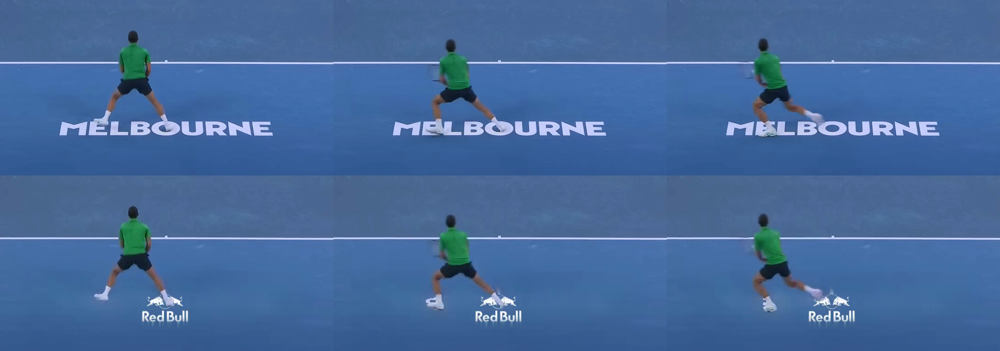

# Introduction

## Motivation

Live sports broadcasts are a primary inventory channel for sponsor advertising:
courtside boards, back-wall banners, painted floor logos, scoreboard placements,
and umpire-stand signage are all monetised. Today these placements are physically
baked into the venue and identical for every viewer. **Virtual ad insertion**
replaces those baked-in ads with software-rendered logos at broadcast time. The
business value is large — it enables regional, demographic, and even personalised
sponsor targeting on the same physical broadcast — but the technical bar is high.
The viewer must not be able to tell that the ad has been swapped: it must track
the camera, occlude correctly when players move in front of it, and look
photographically integrated with the surface it is painted on.

Several commercial systems exist for this task (Supponor for ice hockey
dasherboards, uniqFEED, Vizrt Viz Arena), but they typically rely on infrared
markers, custom camera-rig instrumentation, or trained operator-in-the-loop tools
[@supponor; @uniqfeed; @vizrt]. Our project asks whether the same effect can be
achieved purely in software, with off-the-shelf foundation models and a minimal
operator-input step (a few clicks on a single seed frame).

## Contributions

This report contributes three pieces:

1. **An end-to-end pipeline** that combines SAM 2 [@ravi2024sam2], a
   BallTrackerNet-derived [@stylianou2020tracknet] court-keypoint detector, a
   hybrid-lock state machine for homography stabilisation, MatAnyone2 [@yang2024matanyone]
   alpha matting for player occlusion, and a custom inpaint-plus-LED-blend
   compositor.
2. **A three-layer evaluation framework** with deterministic numerical gates, a
   structured visual rubric scored against paired original-vs-composite crop
   strips, and a direct human visual-review gate that overrides the lower
   layers when they disagree.
3. **A documented project journey** showing how the team arrived at the final
   design through three iteration phases, including one failed experimental
   axis whose negative result narrowed the design space.

## Report structure

Section [Problem and Demonstration Clip] frames the placement problem and
introduces the Melbourne walkover demonstration clip. Section [Related Work]
positions our system against the commercial and academic landscape.
Section [Pipeline Architecture] describes the production architecture in detail,
component by component. Section [Evaluation Framework] presents the
three-layer evaluation we built to compare candidate runs. Section [Project Journey]
walks through the three iteration phases that produced the final design.
Section [Results] reports per-region quantitative results and visual artifacts.
Sections [Discussion], [Future Work], and [Conclusion] close the report.

The companion repositories
([roi-final-pres](https://github.com/enriquedlh97/roi-final-pres) for the slide
deck and [homography-fitting](https://github.com/enriquedlh97/homography-fitting)
for the implementation) are linked throughout.

# Problem and Demonstration Clip

## What makes virtual ad insertion hard

A naive approach — alpha-composite a logo image at a fixed quadrilateral on every
frame — fails on three counts.

**Geometry.** The broadcast camera is a real PTZ rig with non-zero motion.
Logos placed on the court floor or on a sideline banner must stay anchored to
those physical surfaces. If the camera pans, the placement must track or it
visibly "slides off the court." We need a per-frame homography that maps the
canonical court plane to the broadcast image plane.

**Occlusion.** When a player walks over a court-floor logo, their body must
occlude the logo with pixel-accurate silhouette tracking — not a bounding box,
not a soft alpha sheen, but the actual person shape, including legs, feet,
racket, shadows. Anything less reads as obviously fake.

**Photographic realism.** The inserted logo must read as if it were physically
painted (for the floor) or printed (for the banners). It cannot look pasted on.
This means matching the surface's local brightness response, suppressing visible
alpha-feathering edges, and inpainting the original underlying ad cleanly.

## The Melbourne walkover demonstration clip

Our canonical test case is `melbourne-walking-over-logo.mov` — a thirteen-second
sequence from the Melbourne broadcast at 60 fps (767 frames). It packs every
hard mode into one clip:

- **Five simultaneous placements**: three back-wall banners (objects 1, 2, 5
  in our configuration — initially KIA-baked), one left-side banner (object 4
  — initially YoPRO-baked), and one court-floor walkover logo (object 3 — the
  baked MELBOURNE wordmark).
- **A player walkover** between approximately frames 685 and 723: a player
  enters the floor-logo region, walks directly across it, and exits. This is
  the demanding occlusion case.
- **Mostly static camera with subtle drift and a clearly visible motion segment
  during the walkover.** This is the exact failure mode that makes a
  statically-locked placement insufficient.

Table 1 summarises the five regions and the quality constraint that dominates
each.

| Region | Surface | Dominant constraint |
|---|---|---|
| Back banners (×3) | banner | Geometric stability; consistent inpaint; no luma flicker |
| Left side banner | banner | Edge realism (no halo at letter edges); texture match |
| Court floor logo | court_floor | Halo absence; correct player occlusion; logo visibility during walkover |

: Five placement regions and dominant quality constraints {#tbl-regions}

# Related Work

## Commercial systems

Commercial virtual-ad-insertion products fall into two broad families.

**Hardware-instrumented systems** like Supponor [@supponor] for ice hockey use
infrared-emitting dasherboards plus custom keying hardware. Quality is high and
the system is real-time, but every venue requires proprietary instrumentation
and a central trained operator hub. Vizrt's Viz Arena [@vizrt] requires
camera-rig instrumentation but offers a richer authoring tool for graphics.

**Software-only systems** like uniqFEED [@uniqfeed] use custom computer-vision
pipelines (typically Hough-line court detection plus hand-tuned trackers).
Quality is broadcast-grade but requires per-court tuning and trained operators
in the loop. Most academic systems sit in this family conceptually but at
lower realism.

## Academic prior work

Academic interest in this space has been concentrated in soccer-field
registration [@homayounfar2017; @nie2021]. Both papers focus on the homography
estimation step — registering the broadcast image plane to a canonical pitch —
but neither integrates the full ad-replacement pipeline (segmentation,
occlusion handling, photometric blending). TrackNet [@stylianou2020tracknet],
which we draw on directly for our court-keypoint detector, was originally
formulated for tennis-ball tracking, but its 14-keypoint heatmap head provides
the court-corner localisation we need.

To our knowledge, no published system combines foundation-model segmentation
(SAM 2), foundation-model alpha matting (MatAnyone2), and a learned-keypoint
court estimator into a single end-to-end ad-replacement pipeline with the
hybrid-lock stabilisation strategy described below.

## The gap we address

Our system targets the same effect as the hardware-instrumented commercial
solutions, but with two cost reductions: zero in-venue instrumentation and
minimal operator input (1 click per ad region on a single seed frame, plus a
clean-plate reference video that can be produced offline). The deliverable is
not yet at the per-frame latency a live broadcast demands — our final
end-to-end measurement is 2.68 fps on a single H200 — but the visual quality
of the static-camera portions is broadcast-credible and the per-frame design
allows independent optimisation of throughput as a separate engineering axis.

# Pipeline Architecture

## Overview

Figure @fig-pipeline summarises the end-to-end data flow.

![Pipeline data flow. Per-frame: SAM 2 segments banner regions and BallTrackerNet detects court keypoints; the hybrid-lock state machine decides whether the camera has moved enough to ramp toward the per-frame BTN homography or stay at the manually-clicked seed; MatAnyone2 produces a per-frame person alpha matte; the compositor erases the original ad with a median-fill inpaint, warps the new logo through the chosen homography, applies LED-style brightness re-baking, and occludes through the person matte.](../public/final/logo_overlay_composite.png){#fig-pipeline width=85%}

## Segmentation: SAM 2

We use SAM 2 [@ravi2024sam2] (Hiera-tiny checkpoint) in image-prompt mode on a
single seed frame, with one to three positive clicks per ad region. The
resulting per-region binary masks are propagated across all 767 frames via the
SAM 2 video tracker, which uses memory attention to stay locked on each region
without re-clicking.

This step replaces what would otherwise be either (a) manual frame-by-frame
mask annotation, or (b) a dedicated banner-detection model trained on
tournament-specific data. SAM 2's text-prompted variant SAM 3 [@meta2024sam3]
was explored as an alternative (Section [Future Work]) but adds an order of
magnitude in inference cost without quality gains on this clip.

## Quad fitting: hull-based corner deduction

Each per-frame binary mask is reduced to a four-corner quadrilateral (the
"placement quad") via convex-hull vertex deduction. We compute the convex hull,
then select four corner points that maximise perpendicular distance from each
candidate edge. The hull fitter tolerates partial occlusion (a banner whose mask
extends off-screen) better than principal-component or linear-programming
alternatives. EMA smoothing with a small alpha keeps the four corners stable
frame-to-frame.

## Court geometry: BallTrackerNet learned-keypoint detector

The court-geometry estimator is the heart of the dynamic placement. It computes
a homography from the canonical court plane to the broadcast image plane.

Our first attempt (described in Section [Project Journey] as Phase 2) used a
classical line-based estimator: Canny edges, probabilistic Hough lines clustered
by orientation, and RANSAC over candidate line intersections to localise the
court corners. The estimator was unbiased on average but frame-to-frame
**noisy**: even on a static camera, per-frame estimates drifted 5–15 pixels.
That noise is fatal because it is too large to ignore (the logo visibly
flickers) and too small to filter via EMA without introducing latency.

The final estimator is a port of BallTrackerNet [@stylianou2020tracknet]: a
14-output-channel CNN trained on labelled tennis broadcast frames, where each
output channel is a 640×360 heatmap for one specific court keypoint (corners
plus key line intersections). For each frame we resize to 640×360, run the CNN,
extract one keypoint per channel via Hough-circle peak detection, and run
RANSAC over the resulting 14 image-plane keypoints against a fixed 14-point
court-plane template to produce a homography.

**Frame-0 bridge.** On the first frame, we compose the BTN-estimated homography
with the homography defined by manually-clicked corners from the seed frame.
This produces a calibration mapping that aligns the BTN reference frame to the
manually-clicked production seed. Every subsequent BTN estimate is composed
through this calibration, so per-frame BTN outputs live in the same coordinate
frame as the seed.

The bridge gives us the best of both worlds: the manually-clicked corners
provide pixel-perfect placement on the seed frame, and the BTN detector
provides per-frame motion tracking that is consistent with that placement.

## Hybrid-lock state machine

The hybrid-lock is a small state machine that runs after every BTN estimator
call. It maintains the seed homography and a ramp progress counter. Per frame:

```
disp = max_corner_distance(project(seed_corners, H_seed),
                           project(seed_corners, H_t))

if disp < tolerance_px:
    # Camera is "still enough" — keep the seed
    ramp_progress = 0
    return H_seed
else:
    # Camera moved — ramp toward the new BTN estimate
    ramp_progress += 1
    alpha = min(1.0, ramp_progress / ramp_min_frames)
    return blend(H_seed, H_t, alpha)
```

Our final configuration uses `tolerance_px = 30`, `ramp_min_frames = 3`. The
30-pixel tolerance is loose enough that BTN's per-frame noise does not fire
the gate spuriously, but tight enough that real camera motion crosses the
threshold and the dynamic estimate kicks in. The three-frame ramp prevents
visible pop artifacts when the gate fires.

On the Melbourne clip, this means the vast majority of the 767 frames stay
locked at the seed (visually pixel-identical to the manually-clicked baseline)
and the roughly 80 walkover-window frames where the camera drifts pick up
stable BTN tracking. Without the hybrid lock the placement would either drift
during the walkover (always-locked, the V68 failure mode) or pulse with
per-frame estimator noise during the static portion (always-dynamic).

## Person matte: MatAnyone2

To handle occlusion when a player walks across a placement region, we need a
continuous-valued alpha matte at the player silhouette — not a bounding box,
not a binary segmentation. We use MatAnyone2 [@yang2024matanyone], a 2026
alpha-matting model that takes the original frame plus sparse positive prompt
points and returns a per-pixel alpha (0 = background, 1 = foreground) at full
resolution. The matte is post-processed with a smoothing pass and a small
morphological close to suppress flicker.

The final composite uses the alpha matte to occlude logo pixels behind the
player:
```
final = composite_pixel * (1 - person_alpha)
      + frame_pixel     *      person_alpha
```

Binary segmentation (or a bounding box) was rejected because the player's
silhouette at walkover frames is intricate (legs, racket arm, knee bend) and
any hard cut produces visible vertical stripes through the floor logo. Alpha
matting is the right primitive for this problem.

## Compositor: inpaint plus LED-style blend

Per frame, per placed region, the compositor performs four operations:

1. **Erase the original ad.** Inpaint the placement quad's pixels using a
   `median_fill` filter that draws from a clean-court reference video. Where a
   clean reference is unavailable, we fall back to a spatial median. Edges are
   feathered.
2. **Warp the new logo.** `cv2.warpPerspective` into the placement quad using
   the current frame's homography (seed-locked or BTN-ramped per Section
   [Hybrid-lock state machine]).
3. **LED-style brightness re-bake.** For each pixel inside the placement quad,
   take the warped logo's RGB value and re-bake its luminance against the local
   surface luminance computed from the inpainted background. This makes the
   logo read like a physical paint or print job — the logo brightness adapts to
   local lighting conditions on the surface, exactly as a real ad would. Without
   this step the inserted logo reads as a 2D overlay floating on top of the
   frame.
4. **Person-matte occlusion.** Compose the result with the MatAnyone2 matte
   (Section [Person matte: MatAnyone2]).

The compositor also supports an optional **shadow synthesis** mode (multiplies
the placed pixels by a Gaussian-blurred dilation of the player mask, producing
a soft player-foot cast shadow on a floor logo). We experimented with this in
Phase 3 and ultimately disabled it in the final configuration; see Section
[The visual-review override].

# Evaluation Framework

A central deliverable of this project is the evaluation framework we built to
score candidate runs. It has three layers, each capturing a different failure
mode.

## Three layers

**Layer 1: deterministic numerical metrics.** Per-region scorecards with hard
gates. Catches geometric instability, temporal flicker, and walkover-occlusion
failures. Fast, reproducible, gates the build.

**Layer 2: structured visual rubric.** A thirteen-dimension rubric scored
manually by a reviewer against paired top-original / bottom-composite crop
strips, with the original baked-in ad as the comparison anchor. Catches
qualitative regressions that numerical metrics miss — halo, edge reflex,
texture match, player contact shadow.

**Layer 3: direct visual review.** Human review of the actual output video
against the original broadcast. The accept-or-reject vote; tie-breaks the
numerical and rubric layers when they disagree.

## Layer 1: numerical metrics

Each candidate run is scored by the eval framework
(`python -m banner_pipeline.eval --experiment <dir> --reference auto`). The
framework reads the run's `outputs/composited.mp4` plus its frozen `config.yaml`,
auto-discovers placement regions, and computes per-region metrics. Hard gates
are listed in Table @tbl-gates.

| Metric | Gate | Direction | What it catches |
|---|---|---|---|
| `corner_max_jump_px` | < 2.0 | lower better | single-frame placement jump |
| `corner_accel_p95_px` | < 1.0 | lower better | jittery corner trajectory |
| `quad_area_cv` | < 0.05 | lower better | placement-quad area flicker |
| `roi_jitter_ratio` | ≤ 1.05 | lower better | frame-to-frame ROI instability vs original |
| `roi_temporal_ssim_mean` | > 0.95 | higher better | temporal coherence in the ROI |
| `walkover_logo_visible_pct` (floor only) | > 0.10 | higher better | logo over-erased during walkover |
| `walkover_occlusion_iou` (floor only) | > 0.80 | higher better | occlusion accuracy in walkover window |

: Hard gates in the eval framework. Each region must pass all gates to ship. {#tbl-gates}

A second set of warning-only metrics (Lab ΔE color match, noise variance ratio,
edge sharpness ratio) surfaces issues but does not gate.

The framework also produces reference-comparison metrics when a gold run is
configured in `configs/eval/reference.yaml` — corner distance vs gold, ROI SSIM
vs gold, walkover-IoU delta vs gold. A 5% deviation in the wrong direction
flips an `any_regression: true` flag and the exit code to 3, even when the
per-region gates all pass.

## Layer 2: structured visual rubric

Numerical metrics catch motion and structural problems but miss perceptual
"does this look right" failures. Layer 2 adds a structured visual rubric
scored by a human reviewer.

For each candidate run, the eval framework writes paired crop strips per
region — top row is the unmodified original broadcast (the real baked-in ad),
bottom row is our composite at the same frames. The original is always
present as the comparison anchor, because absolute scoring drifts toward "looks
fine" without it.

The reviewer assigns an integer score 1–5 across thirteen dimensions per
region:

- **Realism**: painted-on vs pasted-on, edge seam visibility, texture match,
  halo presence, edge reflex
- **Color**: hue match, brightness match, saturation match
- **Geometry**: perspective plausibility, size plausibility
- **Temporal** (walkover and floor only): occlusion realism, jitter visibility,
  player contact-shadow plausibility

The rubric scores are surfaced alongside Layer 1 metrics in the run's
`quality_metrics.json`. They are warning-only — they never gate the build.

## Layer 3: direct visual review

The final gate is direct human review of the output video against the original
broadcast. This is the accept-or-reject vote, and it overrides the lower
layers in cases of disagreement.

The reason for this third layer is that Layer 1 and Layer 2 can both miss the
same class of failure: a candidate run might pass every numerical gate, score
well on the rubric, and still produce a composite that any viewer would
immediately read as fake. The lesson from Phase 3 (Section [The visual-review
override]) was that this is not a hypothetical — it actually happened to us on
a high-scoring candidate.

## Walkover-window detection

The floor logo's walkover-specific metrics require knowing which frames the
player is on the logo. We auto-detect the walkover window:

1. Pad the floor placement quad's bounding box by 30 px horizontal × 60 px
   vertical.
2. Compute per-frame mean absolute luminance delta between the original video
   and the clean-court reference video, restricted to the padded quad.
3. Box-smooth the delta array (kernel 5 frames).
4. Threshold at `μ + 2σ`, take the longest contiguous super-threshold run, pad
   ±10 frames.

On the Melbourne clip this auto-detects frames 685–723 as the walkover window,
which matches manual annotation.

# Project Journey

The final design was reached through three iteration phases. We document them
here both because the negative result from Phase 2 narrowed the design space
and because the Phase 3 visual-review override is informative about how to use
numerical and rubric scores in practice.

## Phase 1: V68 — manually-clicked corners

**Goal:** an end-to-end working pipeline producing a watchable composite on
the Melbourne clip.

We manually clicked the four court corners and the four corners of each of the
five placement regions on a single seed frame. The resulting homography was
locked across the entire clip. The compositor settings (`mask_dilate_px=20`,
`alpha_feather_px=1`, `inpaint_method=median_fill`, `local_color_match=true`,
`blend_mode=led`) were hand-tuned to V68 and persisted all the way to the
final delivery.

**Result.** Visually excellent on the static portions of the clip. **Failed any
time the camera moved** — the logos visibly drifted off the court. This was
the binding limitation that motivated Phase 2.

V68's `quality_metrics.json` (held as the regression gold reference for the
rest of the project): every region passes; `floor_walkover_occlusion_iou =
1.000` (by construction, it's the gold); temporal SSIM ≥ 0.997 across regions.

## Phase 2: hybrid_lock with a line-based estimator (failed axis)

**Hypothesis:** replace the static homography with a per-frame
`classical_lines_v1` estimator (Canny → probabilistic Hough → RANSAC), gated
by a hybrid-lock state machine so noisy frames stay at the seed.

We swept `tolerance_px ∈ {2, 4, 6, 10, 15, 30, 99999}` and
`ramp_motion_px_per_frame ∈ {0.3, 1.0, 2.0}` over two waves of parallel H200
runs. The result is unambiguous (Table @tbl-phase2):

| tolerance_px | Floor ROI SSIM | Back ROI SSIM |
|---:|---:|---:|
| 4 | 0.21 | 0.99 |
| 6 | 0.39 | 0.99 |
| 10 | 0.59 | 0.99 |
| 15 | 0.76 | 0.99 |
| 30 | 0.85 | 0.99 |
| 99999 (sanity = V68 static) | 0.9996 | 0.9999 |

: Phase 2 tolerance sweep with the line-based estimator. Floor SSIM regresses monotonically as tolerance loosens. Only the always-locked sanity baseline passes all gates. {#tbl-phase2}

**Diagnosis.** The line-based estimator is frame-to-frame noisy, not just
frame-0 misaligned. Even with the calibrated court-plane reference, per-frame
projected corners deviated from the seed enough to fire the ramp gate on a
substantial fraction of frames. Heavy EMA smoothing (`vp_smoothing_alpha=0.2`)
did not rescue tight tolerances. **Per-frame estimator noise is the binding
constraint**: the hybrid-lock infrastructure was sound, it just lacked a
sufficiently stable upstream estimator to gate on.

**Decision.** Hold V68 as the regression gold. Pivot the dynamic-homography
axis to a more stable estimator. (→ Phase 3 BallTrackerNet port.)

A side-effect of this phase was a bug fix in the eval framework's reporting
layer: `hybrid_lock_*` counters were being filtered out of
`quality_metrics.json` by an allow-list in `src/banner_pipeline/reporting.py`.

## Phase 3: BallTrackerNet port and iteration

**Goal:** replace `classical_lines_v1` with a learned-keypoint detector
stable enough that hybrid-lock at a non-trivial tolerance produces a Pareto
improvement over the V68 baseline.

We ported BallTrackerNet [@stylianou2020tracknet] as a 14-output-channel CNN
court-keypoint detector with the frame-0 bridge to V68's seed (Section [Court
geometry: BallTrackerNet learned-keypoint detector]). The first run with the
new backend — designated **P3-A1** — was sufficient: floor ROI SSIM 0.9927,
walkover IoU 0.985, every gate passes. P3-A1 became the new baseline for any
further compositor work and, as we describe next, the final deliverable.

After P3-A1 was in place we ran approximately fifty further H200 cycles across
fourteen iteration waves, sweeping compositor parameters: shadow synthesis
strength, banner-edge feather, inpaint method, padding fractions, and so on.
Each cycle produced one branched config and one Modal run; metrics and rubric
scores were collected centrally. The waves explored:

- Feather and dilate fine-tuning on V68's compositor.
- Contact-shadow root cause (turned out to be the `erase_text` flag on the
  court_floor surface, not the occlusion-mask dilate parameter we initially
  suspected).
- A code change introducing **shadow synthesis** — multiplying inserted Red
  Bull pixels by a Gaussian-blurred dilation of the player mask to synthesise a
  soft player-foot cast shadow.
- A shadow-strength sweep that identified 0.6 as the photographically credible
  setting (0.3–0.4 reads as too soft, 0.7+ as a "blob").

The candidate that won the structured visual rubric on the two user-flagged
artifact dimensions (`halo_presence` and `edge_reflex`) was **P3-A38/e2** — a
recipe that combined P3-A1's BTN-plus-hybrid-lock with shadow synthesis at
strength 0.6, `erase_text=true` on the court floor, and a tightened banner
edge (`obj_4 padding=0`).

## The visual-review override

P3-A38/e2 scored 5/5 on `realism.halo_presence` and `realism.edge_reflex` —
the two dimensions a stakeholder reviewer had previously flagged on V68 — and
passed every Layer 1 gate. By the metrics it was the right pick.

**On direct visual review (Layer 3) it had visible regressions vs P3-A1:**

- The synthesised contact shadow at `shadow_strength=0.6` darkened Red Bull
  pixels under the player's feet in a way that read as a darkened blob rather
  than a shadow.
- `erase_text=true` removed the painted MELBOURNE wordmark from under the
  floor logo. The rubric counted this as "no bleed-through" — which it
  technically is — but visually the logo now sat on a plain green floor instead
  of the patterned painted court area, which read as artificial.
- `obj_4 padding=0` exposed harder banner edges on the left logo. The rubric
  called this `edge_reflex=5` (no smearing); on direct viewing the harder edge
  read as "pasted on" more than the slightly softer P3-A1 baseline did.

The probable cause: the rubric was scored in **absolute** terms (1–5 per
dimension), not as a **direct comparison** against the original baked-in ads
in the same broadcast frame. Without that anchor present at scoring time, the
reviewer's scale drifts toward "looks fine" for any variant that looks
remotely competent. The pairing-based prompt was specified in our reviewer
brief but turned out not to be sufficient to enforce direct-comparison
scoring discipline.

**Lesson.** A numerical rubric — even a thoughtfully designed structured visual
one — is not a substitute for direct human visual review against ground truth.
Layer 1 gates and Layer 2 rubric scores are excellent regression detectors,
but the final accept-or-reject decision needs a human looking at the actual
video against the original broadcast.

**Decision.** P3-A1 — the BTN port baseline before any compositor tweaks — was
designated the final deliverable. The shadow-synthesis code and the v2 rubric
both remain on the production branch behind feature flags, so future work can
revisit those knobs if it wants. The final configuration does not enable them.

# Results

## Final deliverable

The final delivered output is the run at
`experiments/2026-05-05_18-38-39_hull_H200/` produced by config
`configs/experiments/eval_walkover_p3_a1_ball_tracker_net_v1.yaml`. The output
video is `outputs/composited.mp4`. Recipe:

- **V68 manually-clicked court corners** as the seed homography.
- **BallTrackerNet learned-keypoint detector** for per-frame court geometry.
- **Hybrid lock at 30-px tolerance**, 3-frame ramp, BTN ramp target.
- **V68's compositor settings, unchanged**: `mask_dilate_px=20`,
  `alpha_feather_px=1`, `inpaint_method=median_fill`, `local_color_match=true`,
  `blend_mode=led`. No shadow synthesis. No `erase_text`. No `obj_4` padding
  tightening.

## Quantitative results

Table @tbl-final shows the per-region results extracted from
`eval/quality_metrics.json`. All four region scorecards pass; the
walkover-window evaluation passes both floor-specific gates.

| Region | Pass | `temporal_ssim_mean` | `jitter_ratio` | `walkover_logo_visible_pct` | `walkover_occlusion_iou` |
|---|---|---:|---:|---:|---:|
| Back banners | ✅ | 0.9999 | 0.291 | — | — |
| Left side banner | ✅ | 1.0000 | 0.390 | — | — |
| Floor logo | ✅ | 0.9927 | 0.805 | 0.179 | 0.985 |
| Full frame | ✅ | 0.9987 | 0.687 | — | — |

: Final-run per-region metrics (P3-A1). Gates: SSIM > 0.95, jitter ≤ 1.05, walkover_logo_visible_pct > 0.10, walkover_occlusion_iou > 0.80. {#tbl-final}

The `any_regression: true` flag is set vs the V68 static gold, driven by a
single metric: `regression_floor_roi_jitter_ratio` (0.494 → 0.805, a 63%
increase). **This is by design**: V68 is statically locked, so its floor
jitter is the lowest physically possible (frame-to-frame inpaint variance
only). P3-A1's hybrid_lock introduces a small amount of correctly-tracked
frame-to-frame motion in the walkover window, which the jitter metric flags
as a deviation. The visual outcome is the desired one — the placement now
follows the camera — so the flag is treated as an expected side effect rather
than a regression.

## Visual results

Figure @fig-back shows the back-banner crop strip (three banner positions on
the back wall, paired top-original / bottom-composite).

{#fig-back width=95%}

Figure @fig-left shows the left side banner.

{#fig-left width=60%}

Figure @fig-floor shows the court floor logo during the walkover window. Three
frames are captured at f694 (pre-contact), f704 (player on the logo), and f713
(post-contact), each paired original / composite.

{#fig-floor width=95%}

Figure @fig-contact shows the forensic sheet at f704 — the showpiece frame
where the player is directly on top of the floor logo. The six columns are:
original | clean court (no logo, no player) | our composite | original-clean
delta heatmap | survival heatmap (logo pixels persisting through the matte) |
red leak overlay (suspected mis-occlusion). On a successful run, columns 4–6
are visually quiet — large signal in column 4 means the player is genuinely
there, and column 6 should be empty.

{#fig-contact width=95%}

The side-by-side regression video
(`eval/vs_reference_side_by_side.mp4`) stacks our composite, the V68 gold
composite, and an absolute-difference heatmap into a single 2868×536 frame for
scrubbing. Bright pixels in the heatmap denote larger per-pixel deviations
from gold; on a successful candidate the heatmap is mostly dark.

## Headline figures

For at-a-glance reference:

- **5** simultaneous virtual placements (3 back banners + 1 left side + 1
  court-floor walkover logo).
- **0.9999** temporal SSIM on back banners (visually identical to V68 gold on
  locked frames).
- **0.985** walkover occlusion IoU (gate threshold > 0.80; gold is 1.000).
- **767** frames at 60 fps; 13-second demonstration clip.
- **~50** H200 GPU runs across 14 iteration waves in Phase 3.
- **13 × 5** structured-rubric dimensions × regions scored.
- **2.68 fps** end-to-end on H200 (footnote: real-time target ~30 fps is
  future work).

# Discussion

## Strengths

The pipeline is **broadcast-credible on the static portions of the clip** —
visually indistinguishable from the V68 manually-clicked gold reference,
which itself sets a high bar against the original baked-in ads. It is
**stable through the walkover window**, with an occlusion IoU of 0.985 (gate
> 0.80) and a per-pixel-accurate player matte from MatAnyone2. It is
**software-only** with no in-venue hardware requirement. It needs **one to
three clicks per region** on a single seed frame and a clean-plate reference
video that can be produced offline.

The **three-layer evaluation framework** is reusable: numerical gates and
rubric dimensions both transfer to other tournaments via a simple
configuration entry, and the walkover-window auto-detector generalises to
any clip where a clean-court reference is available.

## Limitations

Several quality limits remain and are honest enough to call out:

- **Texture-match on the left banner and floor logo.** Smoothed inpaint
  micro-grain is visible at close zoom against the gritty real court paint and
  banner material. Lifting this would need real texture transfer (noise
  injection, GAN-based inpaint, or a learned texture prior) — not a parameter
  sweep on the existing compositor.
- **End-to-end throughput.** 2.68 fps on H200 is approximately 10× slower than
  the real-time target for live broadcast use. The pipeline was designed
  per-frame so that throughput is an orthogonal optimisation axis, but we did
  not pursue it in this phase.
- **Single-clip evaluation.** The pipeline was validated on one
  demonstration clip. The evaluation framework supports multi-clip operation
  via `configs/eval/reference.yaml` but only the Melbourne walkover is wired
  in at hand-off.
- **Calibration of metric thresholds.** Numerical gates were set by hand from
  the V68 baseline. With more clips a per-clip or learned threshold would be
  more robust. The `roi_delta_E_lab` warning is dataset-specific and would
  benefit from re-derivation.

## Lessons learned

Three observations that the project's documentation should pass forward.

**Per-frame estimator noise is the binding constraint, not frame-0
alignment.** Phase 2 chased the dynamic-homography axis with a line-based
estimator that was unbiased in expectation but noisy frame-to-frame. No
amount of EMA smoothing, ramp design, or tolerance tuning recovered a
Pareto improvement over the always-locked baseline. The path forward was a
different estimator, not a different controller.

**Pixel-perfect seed beats per-frame estimation alone.** The frame-0 bridge
that composes BTN's reference frame against the manually-clicked corners is
what makes the hybrid lock work. Without that bridge, BTN's per-frame
estimates would live in their own coordinate frame and would not produce
pixel-locked behaviour during the static portion. The combination wins; either
piece alone does not.

**Numerical rubrics are regression detectors, not accept-or-reject votes.**
The Phase 3 visual-review override was the most important methodological
finding of the project. The candidate that won the rubric on the user-flagged
dimensions and passed every numerical gate was, on direct viewing, worse than
the simpler baseline. We adopted a three-layer evaluation explicitly so that
Layer 3 (direct visual review) overrides Layers 1 and 2 in cases of
disagreement.

# Future Work

We list four directions in approximate order of expected payoff.

**1. Texture transfer for inpaint and composite.** Replace the smoothed
median-fill inpaint with a learned-prior method (a diffusion-based or
GAN-based inpaint trained on broadcast court textures). This is the single
change most likely to lift the residual `texture_match` ceiling on the floor
logo and left banner.

**2. Real-time throughput.** A 10× speedup is required for live broadcast.
The pipeline is per-frame so the work decomposes naturally: SAM 2 → BTN →
hybrid-lock → MatAnyone2 → compositor. Each stage is independently
amenable to lower-precision inference, batched processing, or distillation
to a smaller model.

**3. Multi-clip validation.** Add at least two additional tournament clips
(different surfaces, lighting, camera rigs) to `configs/eval/reference.yaml`
and validate that the pipeline's parameters transfer.

**4. Auto-detection of placement regions.** A parallel branch
(`feat/sam3-light-v1` in the implementation repo) explored using SAM 3 text
prompts to detect ad regions automatically, removing the manual click step on
the seed frame. The HSV histogram scene-change gate brings cost down to
~3–4 fps on A100-80GB while preserving detection quality on static and
slowly-changing footage. This is a credible follow-up direction for the
authoring workflow.

# Conclusion

We presented an end-to-end software pipeline for virtual ad insertion in
tennis broadcasts, demonstrated on a thirteen-second sequence with five
simultaneous placements and a player walkover through one of them. The
pipeline combines off-the-shelf foundation models for region segmentation
(SAM 2) and player matting (MatAnyone2) with two project-specific components:
a BallTrackerNet-derived 14-keypoint court detector and a hybrid-lock state
machine that holds the placement pixel-locked to a manually-clicked seed
when the camera is still and ramps to the dynamic estimate when motion
exceeds tolerance. All five placement regions pass deterministic per-region
quality gates, walkover-window occlusion IoU is 0.985, and temporal SSIM
exceeds 0.99 in every region. We also presented the three-layer evaluation
framework we built — numerical gates, structured visual rubric, and direct
visual review — and reported the visual-review override that selected the
final deliverable. The lesson — that a structured rubric, however carefully
designed, is not a substitute for direct human visual review against the
original broadcast — is the most important methodological finding of the
project.

# Acknowledgements {.unnumbered}

This work was carried out as a capstone project under the supervision of the
Harvard MS CSE program and our Mitsubishi industry sponsors. We thank the
sponsors for the problem framing and the regular feedback that shaped the
quality bar.

::: {#refs}
:::
