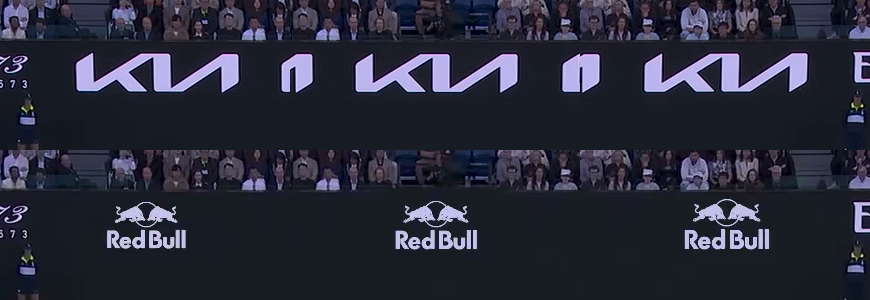
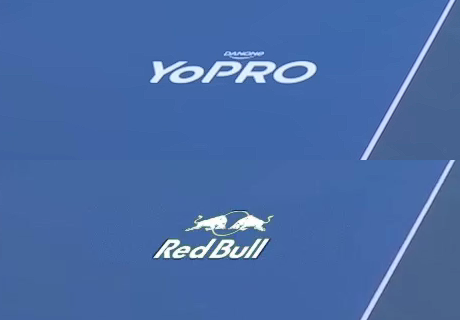



# Introduction

## Motivation

Live sports broadcasts are a primary inventory channel for sponsor advertising: courtside boards, back-wall banners, painted floor logos, scoreboard placements, and umpire-stand signage are all monetised. In current practice these placements are physically baked into the venue and therefore identical for every viewer. *Virtual ad insertion* replaces those baked-in ads with software-rendered logos at broadcast time. The commercial opportunity is large because it permits regional, demographic, and ultimately personalised sponsor targeting on the same physical broadcast, but the technical bar is correspondingly high: the viewer must not be able to tell that the ad has been swapped. The inserted logo must track the camera, occlude correctly when players move in front of it, and look photographically integrated with the surface it is painted on.

Several commercial systems already exist for this task (Supponor for ice-hockey dasherboards [@supponor], uniqFEED for general sports broadcasts [@uniqfeed], and Vizrt's Viz Arena for augmented-reality graphics [@vizrt_arena]), but they typically rely on infrared markers, custom camera-rig instrumentation, or trained operator-in-the-loop tools. Our project asks whether the same effect can be achieved purely in software, with off-the-shelf foundation models and a minimal operator-input step (a few clicks on a single seed frame).

## The gap

The commercial systems above are closed and hardware-dependent. The academic line of work on sports-field registration [@homayounfar2017; @nie2021; @citraro2020sports; @chen2019sports] focuses on the per-frame homography in isolation and does not integrate the downstream components (segmentation, occlusion handling, photometric blending) needed to turn a homography into a credible composite. The capability that has not been demonstrated end-to-end in published software-only work, and that this paper takes as its target, is *per-pixel player occlusion through a court-floor logo during an active walkover*, with all the intermediate components (segmentation, court-plane homography under camera motion, alpha matting, photometric integration) supplied by off-the-shelf foundation models plus a small amount of project-specific control logic.

## Contributions

This paper makes three contributions, each demonstrated on the Melbourne walkover clip and presented as a case study rather than a benchmark result.

1. **An end-to-end software-only pipeline** combining SAM 2 [@ravi2025sam2], a TrackNet-derived court-keypoint detector [@huang2019tracknet; @yastrebksv_tenniscourtdetector], a hybrid-lock state machine for homography stabilisation, MatAnyone [@yang2025matanyone] video alpha matting for per-pixel player occlusion, and a custom inpaint-plus-LED-blend compositor. The combination demonstrates *broadcast-credible* virtual ad insertion on this clip, where we use *broadcast-credible* to mean specifically: a domain reviewer comparing the composite against the original broadcast at native resolution and frame rate accepts it as a substitute for the baked-in ad.

2. **A three-layer evaluation framework** with deterministic numerical gates, a structured visual rubric scored against paired original-vs-composite crop strips, and a direct visual-review gate that overrides the lower layers when they disagree. The framework's primary role is *regression detection* between candidates of the same system; the absolute pass/fail of individual gates depends on thresholds set from the manually-clicked V68 baseline and is honest only in that relative sense (see §5 for the calibration argument).

3. **A documented methodological finding** in which a candidate that won every numerical gate and the structured rubric was rejected on direct visual review. This is one disagreement event with one stakeholder reviewer; we report it as a single case study rather than a generalisable claim about rubric reliability, and we recommend adopting human review as the final gate as a *process* recommendation grounded in this event.

## Paper structure

@sec-problem frames the placement problem and introduces the Melbourne walkover demonstration clip. @sec-related positions our system against the commercial and academic landscape. @sec-pipeline describes the production architecture component by component, with the relevant equations for each stage. @sec-eval presents the three-layer evaluation framework. @sec-journey reports the three iteration phases that produced the final design. @sec-results presents per-region quantitative metrics, the component-evidence map, and the throughput discussion. Discussion, future work, and conclusion close the paper, followed by reproducibility, code-availability, and trademark statements. The implementation is available in our companion code repository [^repo].

[^repo]: Implementation: `https://github.com/enriquedlh97/homography-fitting`.


# Problem Formulation and Demonstration Clip {#sec-problem}

## What makes virtual ad insertion hard

A naive baseline (alpha-composite a logo image at a fixed quadrilateral on every frame) fails on three independent counts.

**Geometry.** The broadcast camera is a real pan-tilt-zoom (PTZ) rig with non-zero motion. Logos placed on the court floor or on a sideline banner must stay anchored to those physical surfaces, or the placement visibly drifts off the court. Formally, we require a per-frame homography $H_t \in \mathrm{PGL}(3, \mathbb{R})$ (a $3 \times 3$ projective transformation defined up to non-zero scale) that maps the canonical court plane $\mathcal{C} \subset \mathbb{R}^2$ to the broadcast image plane $\mathcal{I}_t \subset \mathbb{R}^2$ for every frame index $t$.

**Occlusion.** When a player walks over a court-floor logo, the player's silhouette must occlude the logo at the pixel level (not a bounding box, not a soft alpha sheen, but the actual person shape, including legs, feet, racket, and shadow boundaries). This requires a continuous-valued alpha matte $\alpha_t \in [0,1]^{H \times W}$ rather than a binary mask.

**Photometric realism.** The inserted logo must read as if it were physically painted (for the floor) or printed (for the banners). It cannot look pasted on. This implies matching the surface's local brightness response, suppressing visible alpha-feathering edges, and producing a clean inpaint of the original underlying ad.

## The Melbourne walkover demonstration clip

Our canonical test case is `melbourne-walking-over-logo.mov`, a thirteen-second sequence from the 2026 Melbourne broadcast at approximately 59 fps (767 frames at 1920 $\times$ 1080). It packs every hard mode into one clip:

- **Five simultaneous placements**: three back-wall banners (objects 1, 2, 5 in our configuration, initially KIA-baked), one left-side banner (object 4, initially YoPRO-baked), and one court-floor walkover logo (object 3, the baked MELBOURNE wordmark).
- **A player walkover** between approximately frames 685 and 723: a player enters the floor-logo region, walks directly across it, and exits. This is the demanding occlusion case.
- **Mostly static camera with subtle drift and a clearly visible motion segment during the walkover.** This is the exact failure mode that makes a statically-locked placement insufficient.

@tbl-regions summarises the five regions and the quality constraint that dominates each.

| Region | Surface | Dominant constraint |
|---|---|---|
| Back banners (×3) | banner | Geometric stability; consistent inpaint; no luminance flicker |
| Left side banner | banner | Edge realism (no halo at letter edges); texture match |
| Court floor logo | court_floor | Halo absence; correct player occlusion; logo visibility during walkover |

: Five placement regions on the demonstration clip and the quality constraint that dominates each. {#tbl-regions}


# Related Work {#sec-related}

## Commercial systems

Commercial virtual-ad-insertion products fall into two broad families.

**Hardware-instrumented systems** like Supponor [@supponor] use infrared-emitting dasherboards plus custom keying hardware for ice-hockey broadcasts. Quality is high and the system is real-time, but every venue requires proprietary instrumentation and a trained operator hub. Vizrt's Viz Arena [@vizrt_arena] requires camera-rig instrumentation but offers a richer authoring tool for graphics.

**Software-only systems** like uniqFEED [@uniqfeed] use custom computer-vision pipelines (typically Hough-line court detection plus hand-tuned trackers). Quality is broadcast-grade but requires per-court tuning and trained operators in the loop. Most academic systems sit in this family conceptually, but at lower realism.

## Academic prior work

Academic interest in sports-field registration has been concentrated on soccer pitches and basketball courts [@homayounfar2017; @nie2021; @citraro2020sports; @chen2019sports]. The unifying goal in this line of work is the homography-estimation step alone, registering the broadcast image plane to a canonical pitch under camera motion, viewpoint changes, and partial occlusion. None of these systems integrates the downstream ad-replacement components (segmentation, occlusion handling, photometric blending) that turn a per-frame homography into a broadcast-credible composite. TrackNet [@huang2019tracknet], whose architecture we adapt for our court-keypoint detector, was originally formulated for tennis-ball tracking, but its heatmap-regression backbone has been repurposed by the open-source `TennisCourtDetector` project [@yastrebksv_tenniscourtdetector] to localise court corners.

Foundation-model segmentation has matured rapidly in the last two years. SAM [@kirillov2023sam] established the promptable-segmentation paradigm; SAM 2 [@ravi2025sam2] extended it to video via a memory-attention module. Video alpha matting, in turn, was elevated by MatAnyone [@yang2025matanyone], which combines target-assigned recurrent propagation with a region-adaptive memory fusion that preserves continuous alpha values across frames.

## The gap we address

To our knowledge, no published system combines foundation-model segmentation (SAM 2), foundation-model alpha matting (MatAnyone), and a learned-keypoint court estimator (TrackNet-derived) into a single end-to-end ad-replacement pipeline. Our system targets the same effect as hardware-instrumented commercial solutions with two cost reductions: zero in-venue instrumentation and a one-click-per-region operator input. The final pipeline is not yet at the per-frame latency a live broadcast demands (we measure 2.68 fps on a single NVIDIA H200), but it is broadcast-credible on static-camera portions and the per-frame design admits throughput optimisation as an independent engineering axis (see @sec-future-work).


# Pipeline Architecture {#sec-pipeline}

## Overview

The pipeline is a single-pass, per-frame system. @fig-pipeline summarises the data flow.

::: {#fig-pipeline}

```{=latex}
\begin{center}
\resizebox{\textwidth}{!}{%
\begin{tikzpicture}[
  node distance=6mm and 10mm,
  block/.style={rectangle, draw, rounded corners=2pt, minimum width=20mm, minimum height=9mm, align=center, font=\scriptsize},
  decision/.style={diamond, draw, aspect=2, minimum width=16mm, minimum height=7mm, align=center, font=\tiny, inner sep=1pt},
  frame/.style={rectangle, draw, dashed, minimum width=14mm, minimum height=7mm, align=center, font=\tiny},
  arrow/.style={-{Latex[length=2mm]}, thick}
]
\node[frame] (input) {Input frame $I_t$};
\node[block, right=of input] (sam) {SAM 2\\segmenter};
\node[block, below=8mm of sam] (btn) {TrackNet\\court kpts};
\node[block, right=of sam] (hull) {Hull quad\\fitter};
\node[block, right=of btn] (ransac) {RANSAC\\homography $H_t$};
\node[decision, right=8mm of ransac] (gate) {$d_t > \tau$?};
\node[block, above=12mm of gate] (mat) {MatAnyone\\matte $\alpha_t$};
\node[block, right=12mm of gate] (comp) {Inpaint +\\LED-blend};
\node[frame, right=of comp] (output) {Output $O_t$};
\draw[arrow] (input) -- (sam);
\draw[arrow] (input.south) -- ++(0,-3mm) -| (btn.west);
\draw[arrow] (input.north) -- ++(0,3mm) -| (mat.west);
\draw[arrow] (sam) -- (hull);
\draw[arrow] (btn) -- (ransac);
\draw[arrow] (ransac) -- (gate);
\draw[arrow] (hull.east) -- ++(6mm,0) |- node[above, font=\tiny, near end] {quads} (comp.north west);
\draw[arrow] (gate.east) -- node[above, font=\tiny] {ramp} (comp);
\draw[arrow] (gate.south) -- ++(0,-3mm) -| node[below, font=\tiny, near start] {stay} (comp.south);
\draw[arrow] (mat) -- (comp.north);
\draw[arrow] (comp) -- (output);
\end{tikzpicture}%
}
\end{center}
```

End-to-end pipeline data flow. Per frame: SAM 2 produces banner-region masks; TrackNet-derived keypoint regression yields fourteen court landmarks; RANSAC fits a homography $H_t$; the hybrid-lock state machine decides whether to ramp toward $H_t$ or stay at the manually-clicked seed. MatAnyone produces a per-frame alpha matte $\alpha_t$. The compositor erases the original ad, warps the new logo through the chosen homography, applies LED-style brightness re-baking, and occludes through $\alpha_t$.

:::

::: {.content-visible when-format="html"}

```
            ┌────────────┐      ┌────────────┐
            │ SAM 2      │─────▶│ Hull quad  │──┐
            │ segmenter  │      │ fitter     │  │ placement
            └────────────┘      └────────────┘  │ quads
                  ▲                              ▼
 ┌────────┐       │     ┌────────────┐      ┌────────────┐
 │ Frame  │───────┼────▶│ TrackNet   │      │ Inpaint +  │   ┌────────┐
 │  I_t   │       │     │ court kpts │      │ LED-blend  │──▶│ Output │
 └────────┘       │     └────────────┘      │ compositor │   │ O_t    │
                  │           │             └────────────┘   └────────┘
                  │           ▼                   ▲
                  │     ┌────────────┐ stay       │
                  │     │  RANSAC    │────────────┘
                  │     │ homography │            ▲
                  │     └────────────┘            │
                  │           │  H_t              │ ramp
                  │           ▼                   │
                  │     ┌────────────┐            │
                  │     │ d_t > tau? │────────────┘
                  │     │ hybrid lock│
                  │     └────────────┘
                  │
                  └─────▶ MatAnyone matte α_t ────┘
```

:::

The six stages (segmentation, quad fitting, court-geometry estimation, hybrid-lock gating, alpha matting, and compositing) are described in turn.

## SAM 2 segmentation {#sec-sam2}

We use SAM 2 [@ravi2025sam2] (Hiera-tiny checkpoint) in image-prompt mode on a single seed frame, with one to three positive clicks per ad region. The resulting per-region binary masks are propagated across all 767 frames via the SAM 2 video tracker, which uses memory attention to stay locked on each region without re-clicking.

SAM 2 is a foundation model for *promptable visual segmentation* that unifies image and video segmentation under a single streaming architecture. A *prompt* is any sparse spatial cue indicating the object of interest (a click, a bounding box, or a coarse mask) which the user supplies on one or more frames. The model returns a pixel-accurate mask and, in the video case, propagates that mask through every subsequent frame.

The per-frame image branch follows the SAM lineage but replaces the original Vision Transformer with a *Hiera* hierarchical vision encoder [@ryali2023hiera], whose multi-scale features feed a lightweight prompt encoder and a transformer-based mask decoder. The decoder emits multiple candidate masks together with a scalar intersection-over-union (IoU) prediction used for ambiguity resolution and mask ranking.

The principal departure from SAM 1 is the introduction of a *memory module* that turns the per-image segmenter into a video tracker. Each processed frame is encoded into a compact set of spatial memory tokens and object pointers, written to a first-in-first-out memory bank of recent and prompted frames. When segmenting frame $t$, the mask decoder is conditioned on the current frame features and on cross-attention against this bank. The memory-attention block of [@ravi2025sam2] stacks $L$ transformer layers, each performing self-attention followed by cross-attention against the concatenated memory; schematically, with $F_t$ the Hiera image embedding of frame $t$, $M$ the spatial memory tokens, and $P$ the object pointers, a single block computes

$$
\begin{aligned}
F'_t \;&=\; F_t \;+\; \mathrm{SelfAttn}(F_t), \\[2pt]
\tilde{F}_t \;&=\; F'_t \;+\; \mathrm{CrossAttn}\!\bigl(\,Q = F'_t W_Q,\; K = [M;P]\,W_K,\; V = [M;P]\,W_V\,\bigr).
\end{aligned}
$$ {#eq-sam2-memory}

The decoder then attends $\tilde{F}_t$ against the prompt tokens to emit the frame-$t$ mask. For each prompt the decoder produces $N{=}3$ candidate masks $\{\hat{m}_t^{(k)}\}_{k=1}^{3}$ with predicted IoU scores $s_t^{(k)}$, and the deployed mask is $\hat{m}_t^{\star} = \hat{m}_t^{(k^\star)}$ with $k^\star = \arg\max_k s_t^{(k)}$. This score also gates whether the frame's embedding is written into the memory bank, preventing low-quality frames from corrupting propagation.

This step replaces what would otherwise be either manual frame-by-frame mask annotation or a dedicated banner-detection model trained on tournament-specific data.

![Architecture of SAM 2, after Figure 3 of @ravi2025sam2 (used here under fair-use academic-commentary terms). A Hiera image encoder feeds frame embeddings into a memory-attention block whose keys and values come from a memory bank of recent and prompted frames; the mask decoder takes the conditioned features together with prompt-encoder tokens and emits the per-frame mask. The memory encoder writes each output back into the memory bank for future frames. This is the design that turns a single click on one frame into a temporally coherent mask track across hundreds of frames.](../public/sam-architecture.png){#fig-sam2-arch width=90%}

## Hull-based quad fitting

Each per-frame binary mask is reduced to a four-corner placement quadrilateral via convex-hull vertex deduction. We compute the convex hull $\mathcal{H}_t$ of the mask, then select four corner points that maximise perpendicular distance from each candidate edge. The hull fitter tolerates partial occlusion (a banner whose mask extends off-screen) better than principal-component or linear-programming alternatives. Exponential-moving-average smoothing with a small temporal coefficient keeps the four corners stable frame-to-frame.

## Court-keypoint detection and homography initialisation {#sec-btn}

The court-geometry estimator is the dynamic component of the placement. It computes a per-frame homography that maps the canonical court plane to the broadcast image plane.

We adapt the heatmap-regression convolutional network of TrackNet [@huang2019tracknet], following the open-source `TennisCourtDetector` adaptation [@yastrebksv_tenniscourtdetector] that regresses fourteen semantically labelled court landmarks (four baseline corners, four singles-line intersections, four service-line corners, and two T-points at the centre service line).^[Implementation: [`src/banner_pipeline/court_geometry_ball_tracker.py`](https://github.com/enriquedlh97/homography-fitting/blob/f1e148c/src/banner_pipeline/court_geometry_ball_tracker.py#L450-L720)] The model is a fully convolutional encoder-decoder: a VGG-style contracting path of three pooling stages with 64, 128, 256 channels, followed by a symmetric expanding path with bilinear up-sampling, producing a fifteen-channel output tensor at the input resolution of $640 \times 360$ pixels (fourteen keypoint channels and one auxiliary channel). Each output channel is passed through a sigmoid activation to yield a per-pixel confidence map for one court landmark:

$$
\hat{Y}_k(u,v) \;=\; \sigma\!\bigl(\,f_\theta(I_t)\bigr)_{k,u,v},
\qquad k = 1, \dots, 14.
$$ {#eq-btn-heatmap}

Sub-pixel keypoints are extracted by thresholding each heatmap at $\tau = 170/255$ and locating the centre of the strongest connected blob using OpenCV's `HoughCircles` with a very loose accumulator threshold (`param2 = 2`) and radii in $[10, 25]$ px on the $640 \times 360$ resized frame. This is a peak-centring trick inherited from the upstream `TennisCourtDetector` implementation: HoughCircles is normally a circle detector, but the loose `param2` and the binarised input cause it to return the centre of the strongest super-threshold blob. Concretely,

$$
(\hat{u}_k, \hat{v}_k) \;=\; \operatorname{peakCentre}\!\bigl(\mathbf{1}\{\hat{Y}_k > \tau\}\bigr).
$$

Given $|\mathcal{I}| \geq 5$ image-reference correspondences against a canonical metric court template, we estimate the court-to-image homography $H_t^{\text{net}}$ by RANSAC [@fischler1981ransac] with a five-pixel reprojection threshold. RANSAC selects the homography that maximises the consensus-set size

$$
\hat{H}_t^{\text{net}} \;=\; \arg\max_{H} \;\Big|\bigl\{\, k \in \mathcal{I} \;:\; \bigl\| (\hat{u}_k, \hat{v}_k) - \pi\!\bigl(H\,[X_k, Y_k, 1]^\top\bigr) \bigr\|_2 < \tau_{\text{reproj}} \,\bigr\}\Big|, \quad \tau_{\text{reproj}} = 5~\text{px},
$$ {#eq-btn-ransac}

where $\pi$ is the perspective projection; the returned $H_t^{\text{net}}$ is then refined by least-squares (DLT) over the inlier consensus set. When at least five keypoints are detected we run the RANSAC path above; with exactly four keypoints we fall back to an exhaustive best-of-twelve four-point configuration search (inherited from [@yastrebksv_tenniscourtdetector]); with fewer than four detections the estimator returns no homography on that frame and the placement holds the seed.

To align the learned-keypoint reference frame with the project's pre-existing classical-line backend (so that the YAML-configured `court_quad` fractional coordinates resolve to the same image-plane locations under either estimator), we compose a one-shot bridge between the two reference frames on frame zero:

$$
B \;=\; H_{\text{classical}}(0) \, H_0^{\text{net}\,-1},
$$ {#eq-frame-zero-bridge}

and report the absolute court-plane homography as $H_t = B \, H_t^{\text{net}}$ for all subsequent frames. The manually-clicked seed corners enter separately, via the hybrid-lock state machine described next; this bridge anchors the learned per-frame geometry to a consistent reference frame, not to the manually-clicked seed.

**Single-frame fragility.** The bridge $B$ is computed from the keypoint estimator's frame-0 output. A noisy or partial detection on frame zero (a player occluding a baseline corner, for instance) would corrupt $B$ for the entire clip. A robust alternative is to compute $B$ from a median aggregate of the first $K$ static frames; we did not stress-test this axis on the Melbourne clip, where the seed frame is clean.

## Hybrid-lock state machine

The hybrid-lock is a small state machine that runs after every keypoint-estimator call. It maintains the seed homography $H_{\text{seed}} = H_{\text{manual}}(0)$ and a per-corner *committed position* state $\{\mathbf{c}_i^{(\text{out})}\}_{i=1}^4$. Per frame, letting $\mathbf{c}_i$ denote the $i$-th manually-clicked corner of a placement region, the gate computes the mean projected-corner displacement under the new homography:

$$
d_t \;=\; \frac{1}{4} \sum_{i=1}^{4} \;\bigl\| \pi(H_{\text{seed}} \, \mathbf{c}_i) - \pi(H_t \, \mathbf{c}_i) \bigr\|_2.
$$ {#eq-hybrid-disp}

When $d_t < \tau_{\text{lock}}$ the gate stays locked and the committed positions are held at $\pi(H_{\text{seed}} \mathbf{c}_i)$. When $d_t \geq \tau_{\text{lock}}$ the gate fires and each committed corner is iteratively re-aimed at the new target $\pi(H_t \mathbf{c}_i)$ over $n$ frames via a per-corner recurrence,

$$
\mathbf{c}_i^{(\text{out}, k)} \;=\; \mathbf{c}_i^{(\text{out}, k-1)} \;+\; \frac{1}{n - k + 1}\,\bigl(\pi(H_t \mathbf{c}_i) \,-\, \mathbf{c}_i^{(\text{out}, k-1)}\bigr), \quad k = 1, \dots, n,
$$ {#eq-hybrid-lock}

with ramp length $n = \max(R_{\min}, \lceil d_t / v_{\max} \rceil)$, $R_{\min} = 3$, $v_{\max} = 2~\text{px/frame}$.^[Implementation: [`HybridLockState` in `src/banner_pipeline/court_geometry.py`](https://github.com/enriquedlh97/homography-fitting/blob/f1e148c/src/banner_pipeline/court_geometry.py#L1390-L1450)] The output homography $H_t^{(\text{out})}$ is reconstructed at each frame by fitting a DLT homography from the canonical corners $\{\mathbf{c}_i\}$ to the current committed positions $\{\mathbf{c}_i^{(\text{out},k)}\}$. Our final configuration uses $\tau_{\text{lock}} = 30~\text{px}$: loose enough that keypoint-detection noise does not fire the gate spuriously, tight enough that real camera motion crosses the threshold and the dynamic estimate engages. The ramp length is adaptive: small displacements ramp in three frames; aggressive motion (large $d_t$) ramps over more frames so that the per-frame motion remains bounded by $v_{\max}$ pixels. Operationally this matches the placement's tracking velocity to the camera's apparent motion: a slow drift produces a short, gentle ramp; an aggressive pan or zoom stretches the ramp out so the placement never moves faster than $v_{\max}$ pixels per frame. That is why a zoom-in does not produce a visible "snap" on the inserted logo: the controller's per-frame motion budget is matched to the same scale as the camera's apparent per-frame motion, and pop artefacts are eliminated.

On the Melbourne clip the eval-framework counters report 751 of 767 frames locked at $H_{\text{seed}}$ (visually pixel-identical to the manually-clicked baseline), 16 frames inside the walkover window ramping toward the dynamic estimate, and 0 frames reaching the full estimate state (the camera motion subsides before any ramp completes). Without the hybrid lock the placement would either drift during the walkover (always-locked) or pulse with per-frame keypoint noise during the static portion (always-dynamic).

## Player matte: MatAnyone {#sec-matanyone}

To handle player occlusion across the walkover window we require a continuous-valued alpha matte (not a bounding box, not a binary segmentation). We use MatAnyone [@yang2025matanyone], a 2025 video matting framework that predicts a per-pixel alpha matte $\alpha_t \in [0, 1]^{H \times W}$ for each frame and propagates a single annotated first-frame target through subsequent frames via memory-augmented recurrent decoding.

MatAnyone extends the memory-based video object segmentation paradigm of Cutie [@cheng2024cutie] by storing previously predicted alpha mattes (rather than binary masks) in an external memory bank that is queried at each step via attention over query-key affinities. The single annotated first-frame matte seeds the memory and acts as the target assignment; subsequent frames are processed recurrently, with the value encoder writing the model's own alpha prediction back into memory to enable long-range temporal propagation. The central architectural contribution is a region-adaptive memory fusion module that mitigates the trade-off between temporal stability in semantically homogeneous core regions and responsiveness at fine object boundaries.

A lightweight three-layer convolutional head predicts a per-pixel change probability $U_t \in [0, 1]^{H \times W}$ that gates the contribution of the previous-frame memory readout against the current-frame memory query. The region-adaptive fusion rule is

$$
P_t \;=\; U_t \odot V_t^{m} \;+\; (1 - U_t) \odot V_{t-1},
$$ {#eq-matanyone-fusion}

where $V_t^{m} = A_t V_m$ is the value read from the memory bank via the attention affinity $A_t$, $V_{t-1}$ is the value propagated from the previous frame, and $\odot$ denotes the Hadamard product. $U_t$ is supervised by the binarised alpha-difference indicator

$$
U_t^{\text{GT}} \;=\; \mathbf{1}\!\left[\, \bigl| \alpha_{t-1}^{\text{GT}} - \alpha_t^{\text{GT}} \bigr| \geq \delta \,\right]
$$

with $\delta = 10^{-3}$. Intuitively, $U_t$ is the per-pixel change probability: $U_t \to 1$ in regions where the alpha changed substantially between frames (typically object boundaries), and the fusion weights the freshly-attended memory readout $V_t^{m}$ so that fine detail is preserved; $U_t \to 0$ in stable core regions, and the fusion weights the propagated value $V_{t-1}$ so that flicker is suppressed. Training combines pixel-wise $L_1$ loss in core regions with a Deep Decomposition Constraint loss along boundaries [@yang2025matanyone].

Binary segmentation (or a bounding box) was rejected because the player's silhouette at walkover frames is intricate (legs, racket arm, knee bend) and any hard cut produces visible vertical stripes through the floor logo. Alpha matting is the right primitive for this occlusion problem.

## Inpaint plus LED-style compositor

Per frame, per placed region, the compositor performs four operations.^[Implementation: [`src/banner_pipeline/composite/painted.py`](https://github.com/enriquedlh97/homography-fitting/blob/f1e148c/src/banner_pipeline/composite/painted.py)]

**(1) Erase the original ad.** Inside each placement quad we identify the text-mask region (the baked-in ad pixels) and replace it with a smooth fill matched to the surrounding court colour, plus matched-noise injection so the result does not read as a flat patch:

$$
\hat{I}_t^{\text{inpaint}}(p) \;=\;
\begin{cases}
\bigl( G_\sigma * \mathrm{fill}(I_t, \bar c_t) \bigr)(p) \;+\; \eta(p) & \text{if } p \in \text{text\_mask}_t \\
I_t(p) & \text{otherwise},
\end{cases}
$$

where $\bar c_t = \operatorname{med}_{q \in \text{surround}(\text{text\_mask}_t)} I_t(q)$ is the spatial median of the surround region of the current frame, $G_\sigma$ is a Gaussian blur with kernel size set by `shade_blur_ksize`, and $\eta(p) \sim \mathcal{N}(0, \hat\sigma_{\text{surround}}^2)$ is texture-matched noise calibrated to the variance of the surround. A clean-court reference video, produced offline by temporal-median accumulation across player-absent intervals, is used downstream by the evaluation framework (walkover-window detection and occlusion-IoU) rather than by the per-frame compositor.

**(2) Warp the new logo.** The sponsor logo $L$ is warped into the placement quad through the chosen homography:

$$
\tilde{L}_t \;=\; \mathrm{warp}\!\bigl(L, \; H_t^{\text{out}}\bigr).
$$

**(3) LED-style brightness re-bake.** For each pixel inside the placement quad, the warped logo's chrominance is preserved while its luminance is re-baked against the local surface luminance computed from the inpainted background. Let $Y$ denote the luminance channel. We compute a per-pixel shade map $s_t(p)$ that compares the Gaussian-blurred background luminance at $p$ to the median background luminance inside the placement quad, raised to a configurable strength $s$ and clipped:

$$
\tilde{L}_t^{\text{led}}(p) \;=\; \tilde{L}_t(p) \,\cdot\, \mathrm{clip}\!\left(\frac{Y\!\bigl(G_\sigma * \hat{I}_t^{\text{inpaint}}\bigr)(p)}{\bar{Y}_{\text{quad}, t}}\right)^{\!s}, \qquad \bar{Y}_{\text{quad}, t} = \operatorname{med}_{q \in \text{quad}_t} Y\!\bigl(G_\sigma * \hat{I}_t^{\text{inpaint}}\bigr)(q),
$$ {#eq-led-blend}

with the gain clipped to $[\texttt{shade\_clip\_min}, \texttt{shade\_clip\_max}]$, $\sigma$ set by `shade_blur_ksize`, and $s$ set by `shade_strength`. This makes the inserted logo read like a physically painted or printed ad whose brightness tracks the local lighting on the surface: a logo placed in a shaded part of the court darkens, a logo in a bright patch brightens, all without altering the logo's intrinsic colours. Without this step the logo reads as a 2D overlay floating on top of the frame.

**(4) Person-matte occlusion.** The final composite uses the MatAnyone alpha matte to occlude logo pixels behind the player:

$$
O_t(p) \;=\; \bigl(1 - \alpha_t(p)\bigr) \cdot \tilde{L}_t^{\text{led}}(p) \;+\; \alpha_t(p) \cdot I_t(p),
$$ {#eq-occlusion}

where $\alpha_t(p) = 0$ marks pure background (the logo is fully visible) and $\alpha_t(p) = 1$ marks pure foreground (the player covers the logo). Continuous values in between handle the silhouette anti-aliasing that binary segmentation cannot.

The compositor additionally supports an optional shadow-synthesis mode (multiplying the placed pixels by a Gaussian-blurred dilation of the player mask, producing a soft player-foot cast shadow on a floor logo). This was disabled in the final configuration following the visual-review override described in @sec-override.

![Compositor stage walkthrough on a single banner. Left to right: (1) the original broadcast crop containing the baked-in *blua.* ad; (2) the placement quad detected and outlined; (3) the quad rectified to a fronto-parallel rectangle in the canonical surface frame; (4) the replacement *Ferrari* logo composed in the same rectified frame; (5) the new logo warped back through the inverse homography into the original perspective and blended via the LED-style luminance re-bake (@eq-led-blend). The same pipeline runs per frame for every placement region.](../public/final/compositor_steps.png){#fig-compositor-steps width=100%}


# Evaluation Framework {#sec-eval}

A central deliverable of this project is the evaluation framework we built to score candidate runs. It has three layers, each capturing a different failure mode.

## Three layers

**Layer 1: deterministic numerical metrics.** Per-region scorecards with hard gates. Catches geometric instability, temporal flicker, and walkover-occlusion failures. Fast, reproducible, gates the build.

**Layer 2: structured visual rubric.** A thirteen-dimension rubric scored against paired top-original / bottom-composite crop strips, with the original baked-in ad as the comparison anchor. Catches qualitative regressions that numerical metrics miss (halo, edge reflex, texture match, player contact shadow). Scores are produced one candidate at a time and recorded in the run's machine-readable summary.

**Layer 3: direct visual review.** A domain-expert review of the output video against the original broadcast, at native resolution and frame rate. The accept-or-reject vote; tie-breaks the numerical and rubric layers when they disagree.

## Layer 1: numerical metrics

Each candidate run is scored by the eval framework. The framework reads the run's composited video plus its frozen configuration, auto-discovers placement regions, and computes per-region metrics. Hard gates are listed in @tbl-gates.^[Threshold definitions: [`GATES` / `WALKOVER_GATES` / `WARNINGS` dicts in `src/banner_pipeline/eval/report.py`](https://github.com/enriquedlh97/homography-fitting/blob/f1e148c/src/banner_pipeline/eval/report.py#L20-L37)]

::: {#tbl-gates}

```{=latex}
\begin{center}
\renewcommand{\arraystretch}{1.25}
\footnotesize
\begin{tabular}{@{} p{0.23\textwidth} p{0.30\textwidth} p{0.10\textwidth} p{0.27\textwidth} @{}}
\toprule
\textbf{Metric} & \textbf{Symbol / definition} & \textbf{Gate} & \textbf{What it catches} \\
\midrule
\texttt{corner\_max\_jump\_px} &
$\max_t \|\mathbf{c}_t - \mathbf{c}_{t-1}\|_\infty$ &
$< 2.0$ &
single-frame placement jump \\[2pt]
\texttt{corner\_accel\_p95\_px} &
$\mathrm{pct}_{95}\, \|\mathbf{c}_{t+1} - 2\mathbf{c}_t + \mathbf{c}_{t-1}\|$ &
$< 1.0$ &
jittery corner trajectory \\[2pt]
\texttt{quad\_area\_cv} &
$\sigma(A_t) / \mu(A_t)$, $A_t = \mathrm{area}(\text{quad}_t)$ &
$< 0.05$ &
placement-area flicker \\[2pt]
\texttt{roi\_jitter\_ratio} &
$\dfrac{\text{frame-diff}_{\text{ROI}}^{\text{comp}}}{\text{frame-diff}_{\text{ROI}}^{\text{orig}}}$ &
$\leq 1.05$ &
ROI instability vs original \\[6pt]
\texttt{roi\_temporal\_ssim\_mean} &
$\mathrm{mean}_t \, \mathrm{SSIM}(\mathrm{ROI}_t, \mathrm{ROI}_{t-1})$ &
$> 0.95$ &
temporal coherence in ROI \\[2pt]
\texttt{walkover\_logo\_visible\_pct} &
fraction of $\text{quad}_t$ pixels with logo signal in player-absent rows &
$> 0.10$ &
logo over-erased during walkover \\[2pt]
\texttt{walkover\_occlusion\_iou} &
$\mathrm{IoU}$ of $\mathbf{1}\{|Y(I_t) - Y(C_t)| > T\}$ vs $\mathbf{1}\{|Y(O_t) - Y(L_t^{\text{baked}})| > T\}$ inside $\text{quad}_t$, with $T = 20$ on 8-bit luminance &
$> 0.80$ &
occlusion accuracy in walkover window \\
\bottomrule
\end{tabular}
\end{center}
```

Hard gates in the eval framework. Each region must pass all applicable gates to ship; the two walkover gates apply only to the court-floor region. $C_t$ denotes the clean-plate frame and $L_t^{\text{baked}}$ denotes the gold composite's logo at the same frame index. The SSIM definition follows @wang2004ssim.

:::

A secondary set of warning-only metrics surfaces issues without gating the build: Lab $\Delta E_{ab}^*$ colour match against a neighbouring same-surface patch (warning fires when $\Delta E_{ab}^* > 5$, following the CIEDE2000 conventions of [@sharma2005ciede2000]), noise-variance ratio (warns when the placed region is noticeably smoother than its neighbour, i.e., the "pasted-on" failure mode), and edge-sharpness ratio (warns when the placement-quad boundary has materially higher gradient magnitude than the rest of the frame).

The framework also produces reference-comparison metrics when a gold run is configured. A 5% deviation in the wrong direction flips an `any_regression: true` flag and the exit code to 3, even when per-region gates all pass. The reference comparison computes corner distance versus gold, region SSIM versus gold, and walkover-IoU delta versus gold.

**Honest framing of the gates.** The gate thresholds in @tbl-gates were calibrated by hand from the V68 manually-clicked baseline (the same clip's static-homography composite). Two of the gates have a defensible absolute floor that is independent of the system being evaluated: `roi_temporal_ssim_mean > 0.95` follows perceptual SSIM thresholds in the literature, and `corner_max_jump_px < 2.0` is a direct geometric quality bar in pixel units. The remaining gates (`walkover_logo_visible_pct > 0.10`, `walkover_occlusion_iou > 0.80`, `roi_jitter_ratio` and `quad_area_cv` thresholds) were set so that the V68 baseline passes by construction. A candidate descendant of V68 passing those gates is therefore evidence of "no regression from V68," not of "absolute broadcast quality." We therefore frame the framework's primary role as *regression detection between candidates*; gate-passing in the absolute sense should not be read as third-party certification. A sensitivity sweep over the V68-grounded thresholds (tightening each gate by 10% / 25% / 50% and observing how many candidates still pass) would convert the framework into a more independent quality bar; this remains future work.

## Layer 2: structured visual rubric

Numerical metrics catch motion and structural problems but miss perceptual "does this look right" failures. Layer 2 adds a structured visual rubric scored against paired crop strips.

For each candidate run the eval framework writes paired strips per region: the top row is the unmodified original broadcast (the real baked-in ad), the bottom row is our composite at the same frames. The original is always present as the comparison anchor, because absolute scoring drifts toward "looks fine" without it.

The rubric assigns integer scores in $\{1, \dots, 5\}$ across thirteen dimensions per region:

- **Realism**: painted-on vs pasted-on, edge seam visibility, texture match, halo presence, edge reflex.
- **Colour**: hue match, brightness match, saturation match.
- **Geometry**: perspective plausibility, size plausibility.
- **Temporal** (walkover/floor only): occlusion realism, jitter visibility, player contact-shadow plausibility.

The rubric scores are surfaced alongside Layer 1 metrics in the run's machine-readable quality summary. Rubric scores are warning-only; they never gate the build, but they guide where to investigate.

## Layer 3: direct visual review

The final gate is direct human review of the output video against the original broadcast. This is the accept-or-reject vote, and it overrides the lower layers in cases of disagreement.

The reason for this third layer is that Layer 1 and Layer 2 can both miss the same class of failure: a candidate run might pass every numerical gate, score well on the rubric, and still produce a composite that any viewer would immediately read as fake. The lesson from Phase 3 (@sec-override) is that this is not a hypothetical; it actually happened to us on a high-scoring candidate.

## Walkover-window detection

The floor-logo walkover-specific metrics require knowing which frames the player is on the logo. We auto-detect the walkover window:^[Implementation: [`detect_walkover_window()` in `src/banner_pipeline/eval/walkover.py`](https://github.com/enriquedlh97/homography-fitting/blob/f1e148c/src/banner_pipeline/eval/walkover.py#L37-L156)]

1. Pad the floor placement quad's bounding box by 30 px horizontal $\times$ 60 px vertical.
2. Compute the per-frame mean absolute colour delta between the original video and a clean-court reference video, restricted to the padded quad and averaged over BGR channels: $\Delta_t = \mathrm{mean}_{p \in \text{padded quad}} \, \frac{1}{3} \,\| I_t(p) - C_t(p) \|_1$.
3. Box-smooth $\{\Delta_t\}$ with a five-frame kernel.
4. Threshold at $\mu(\Delta) + 2\,\sigma(\Delta)$, take the longest contiguous super-threshold run, pad $\pm 10$ frames.

On the Melbourne clip this auto-detects frames 685 to 723 as the walkover window, which matches manual annotation.

**A note on circularity.** The auto-detected window uses the same clean-vs-original delta signal that the downstream `walkover_occlusion_iou` metric also uses (with a different threshold; see @tbl-gates). The window detector and the occlusion-IoU metric are therefore not fully independent, and an aggressive reviewer would ask whether the IoU score is partially a function of the window choice. The natural independence fix is to define the window from a generic person detector (YOLO / RTMDet) and cross-check against the clean-vs-original window; we have not run that check on this clip, and it is queued as a follow-up.


# Project Journey {#sec-journey}

The final design was reached through three iteration phases. We document them because the negative result from Phase 2 narrowed the design space and the Phase 3 visual-review override is informative about how to use numerical and rubric scores in practice.

## Phase 1: V68, manually-clicked corners

**Goal.** An end-to-end working pipeline producing a watchable composite on the Melbourne clip.

We manually clicked the four court corners and the four corners of each of the five placement regions on a single seed frame. The resulting homography was locked across the entire clip. The compositor settings (mask dilation, alpha feather, inpaint method, local colour matching, blend mode) were hand-tuned to this configuration (designated **V68**) and persisted unchanged into the final deliverable.

**Result.** Visually excellent on the static portions of the clip; failed any time the camera moved, with logos visibly drifting off the court. This was the binding limitation that motivated Phase 2.

V68's per-region scorecard (held as the regression-gold reference for the rest of the project) passes every gate by construction: $\text{floor\_walkover\_occlusion\_iou} = 1.000$ (it is itself the gold), temporal SSIM $\geq 0.997$ across regions.

## Phase 2: hybrid-lock with a line-based estimator (failed axis)

**Hypothesis.** Replace the static homography with a per-frame `classical_lines_v1` estimator (Canny edges [@canny1986edge], probabilistic Hough lines [@duda1972hough; @matas2000probabilistic], RANSAC over candidate line intersections), gated by a hybrid-lock state machine so noisy frames stay at the seed.^[Implementation: [`CourtGeometryEstimator` in `src/banner_pipeline/court_geometry.py`](https://github.com/enriquedlh97/homography-fitting/blob/f1e148c/src/banner_pipeline/court_geometry.py#L551-L809)]

We swept the tolerance $\tau_{\text{lock}} \in \{2, 4, 6, 10, 15, 30, 99999\}$ and ramp speed $\in \{0.3, 1.0, 2.0\}~\text{px/frame}$ over two waves of parallel runs on H200 GPUs. @tbl-phase2 reports the tolerance axis at the $1.0~\text{px/frame}$ ramp setting; the full 7 $\times$ 3 grid is in the project's experiment ledger and exhibits the same monotonic regression along the tolerance axis at each ramp speed. The headline result is unambiguous.

| $\tau_{\text{lock}}$ (px) | Floor ROI SSIM | Back ROI SSIM |
|---:|---:|---:|
| 4 | 0.21 | 0.99 |
| 6 | 0.39 | 0.99 |
| 10 | 0.59 | 0.99 |
| 15 | 0.76 | 0.99 |
| 30 | 0.85 | 0.99 |
| 99999 (sanity, V68 static) | 0.9996 | 0.9999 |

: Phase 2 tolerance sweep with the line-based estimator. Floor SSIM regresses monotonically as the tolerance loosens; only the always-locked sanity baseline passes all gates. {#tbl-phase2}

**Diagnosis.** The line-based estimator is frame-to-frame noisy, not frame-zero misaligned. Even with the calibrated court-plane reference, per-frame projected corners deviated from the seed enough to fire the ramp gate on a substantial fraction of frames; heavy EMA smoothing did not rescue tight tolerances. We note one confounder: the displacement gate of @eq-hybrid-disp is the mean L2 displacement across the four projected corners, which is direction-blind, so small but systematic vertical drift can be absorbed into the gate without firing. An axis-decomposed gate (separate vertical and horizontal thresholds) was not tested. With that caveat, the actionable conclusion of the sweep is that for this estimator and this gate, no Pareto improvement over the always-locked baseline was reachable; the path forward was a more stable upstream estimator (Phase 3) rather than further controller tuning.

![The classical line-based estimator on the demonstration clip. Hough lines are detected on the court markings (yellow / red), classified by orientation into a depth family and a width family, and intersected to recover the depth vanishing point (off-frame to the left and right). The estimator is unbiased on a static camera in expectation, but the per-frame intersection point drifts by 5 to 15 pixels between consecutive frames because the underlying line set is itself noisy. That residual is large enough to fire the hybrid-lock ramp gate on a substantial fraction of frames and small enough that EMA smoothing cannot suppress it without introducing latency.](../public/homography/vanishing_point.png){#fig-vp width=85%}

**Decision.** Hold V68 as the regression gold. Pivot the dynamic-homography axis to a more stable estimator (Phase 3).

## Phase 3: TrackNet-derived port and iteration

We replaced `classical_lines_v1` with the TrackNet-derived court-keypoint detector described in @sec-btn, composed with the frame-zero bridge of @eq-frame-zero-bridge, and ran the hybrid-lock with $\tau_{\text{lock}} = 30~\text{px}$. The first run with the new backend, designated **P3-A1**, was sufficient: floor-region temporal SSIM 0.9927, walkover occlusion IoU 0.985, every gate passes. P3-A1 became the baseline for the iteration phase that followed.

After P3-A1 we ran approximately fifty further iteration cycles on H200, sweeping compositor parameters: shadow synthesis strength, banner-edge feather, inpaint method, padding fractions, and so on. Each cycle produced one branched configuration and one inference run; metrics and rubric scores were collected centrally. The iteration explored:

- Feather and dilation fine-tuning on V68's compositor.
- Contact-shadow root cause (which turned out to be the `erase_text` flag on the court-floor surface, not the occlusion-mask dilation we initially suspected).
- A code change introducing **shadow synthesis**: multiplying inserted logo pixels by a Gaussian-blurred dilation of the player mask, to synthesise a soft player-foot cast shadow.
- A shadow-strength sweep that identified 0.6 as the photographically credible setting (0.3 to 0.4 reads as too soft; 0.7+ as a "blob").

The candidate that won the structured visual rubric on the two user-flagged artefact dimensions (`halo_presence` and `edge_reflex`) was **P3-A38/e2**: a recipe combining P3-A1's TrackNet-plus-hybrid-lock with shadow synthesis at strength 0.6, the `erase_text` flag on the court floor, and a tightened banner edge.

## The visual-review override {#sec-override}

P3-A38/e2 scored 5/5 on `realism.halo_presence` and `realism.edge_reflex` (the two dimensions a stakeholder reviewer had previously flagged on V68) and passed every Layer 1 gate. On the numerical gates and the rubric alone, it was the recommended candidate.

**On direct visual review (Layer 3) it had visible regressions versus P3-A1:**

- The synthesised contact shadow darkened logo pixels under the player's feet in a way that read as a darkened blob rather than a shadow.
- `erase_text=true` removed the painted MELBOURNE wordmark from under the floor logo. The rubric counted this as "no bleed-through," which it technically is, but visually the logo now sat on a plain green floor instead of the patterned painted court area, which read as artificial.
- Tightened banner padding exposed harder banner edges on the left logo. The rubric called this `edge_reflex=5` (no smearing); on direct viewing the harder edge read as "pasted on" more than the slightly-softer P3-A1 baseline did.

The probable cause is that the rubric is scored in absolute terms (1 to 5 per dimension), not as a direct comparison against the original baked-in ad in the same broadcast frame. Without that anchor present at scoring time, the reviewer's scale drifts toward "looks fine" for any variant that looks remotely competent. The pairing-based prompt was specified in our reviewer brief but turned out not to be sufficient to enforce direct-comparison scoring discipline.

**Lesson, scoped.** In this single disagreement event, with one stakeholder reviewer, the rubric-and-gate verdict diverged from the direct-comparison visual verdict, and the candidate that won the lower layers was the one we ultimately rejected. We treat this as one case study rather than a generalisable claim about rubric reliability: with a single reviewer and a single disagreement we cannot estimate the rate at which the rubric drifts from human preference, nor establish inter-rater reliability for the rubric itself. The actionable *process* recommendation we draw is to keep direct visual review as the final gate in this project's workflow and to design future rubrics so the comparison anchor (the original broadcast frame) is co-present at scoring time. A controlled study with multiple reviewers and a calibration set is the natural follow-up if the process recommendation is to be promoted to a methodological claim.

**Decision.** P3-A1, the TrackNet-port baseline before any compositor tweaks, was designated the final deliverable. The shadow-synthesis code and the v2 rubric both remain on the production branch behind feature flags so future work can revisit those knobs if it wishes; the final configuration does not enable them.


# Results {#sec-results}

## Final deliverable

The final delivered configuration is **P3-A1**, with the recipe:

- V68 manually-clicked court corners as the seed homography $H_{\text{seed}}$.
- TrackNet-derived court-keypoint detector for the per-frame homography $H_t^{\text{net}}$.
- Hybrid lock at $\tau_{\text{lock}} = 30~\text{px}$, three-frame ramp.
- V68's compositor settings, unchanged: median-fill inpaint, alpha feathering, local colour matching, LED-style brightness re-bake. No shadow synthesis. No `erase_text`. No tightened banner padding.

## Quantitative results

@tbl-final reports per-region results extracted from the eval framework's machine-readable summary. All region scorecards pass (the back banners are reported as a group; the left-side banner, the floor logo, and the full-frame summary are reported separately), and the walkover-window evaluation passes both floor-specific gates.

::: {#tbl-final}

```{=latex}
\begin{center}
\renewcommand{\arraystretch}{1.25}
\footnotesize
\begin{tabular}{@{} p{0.22\textwidth} c r r r r @{}}
\toprule
\textbf{Region} & \textbf{Pass} & \textbf{Temporal SSIM} & \textbf{Jitter ratio} & \textbf{Walkover visible \%} & \textbf{Walkover IoU} \\
\midrule
Back banners       & \checkmark & 0.9999 & 0.291 & n/a   & n/a   \\
Left-side banner   & \checkmark & 1.0000 & 0.390 & n/a   & n/a   \\
Floor logo         & \checkmark & 0.9927 & 0.805 & 0.179 & 0.985 \\
Full frame         & \checkmark & 0.9987 & 0.687 & n/a   & n/a   \\
\bottomrule
\end{tabular}
\end{center}
```

Per-region quantitative metrics for the final deliverable (P3-A1). Gates: SSIM $> 0.95$, jitter $\leq 1.05$, walkover visible $> 0.10$, walkover IoU $> 0.80$.

:::

**Reading the metrics.** Temporal SSIM at 0.9999 on the back banners means the placement is, frame to frame, visually identical to the V68 manually-clicked gold (the small residual deviation reflects only the inpaint's frame-to-frame variance). The left side banner reads identically (SSIM 1.0000 at four decimal places). The floor logo's slightly lower SSIM at 0.9927 is the expected consequence of two factors: the active hybrid lock during the walkover window introduces a few frames of correctly-tracked motion, and the floor surface has more luminance heterogeneity than the dark back banners (so any compositor noise is more visible).

The walkover occlusion IoU at 0.985 is the most important single number on this table. The metric measures, inside the floor placement quad, the IoU between *where the player actually is* (estimated as the threshold of $|I_t - C_t|$ against the clean plate) and *where the composite hides the logo* (estimated as $|O_t - L_t^{\text{baked}}|$ against the gold's baked logo). A perfect occlusion would score 1.000; our gate is at 0.80. We achieve 0.985, meaning that for 98.5% of the area where the player is visibly present, our composite correctly suppresses the logo, and conversely 98.5% of the area where the composite suppresses the logo coincides with the player's actual silhouette. The remaining 1.5% is split between sub-pixel matte edges (anti-aliasing at the player silhouette boundary) and a small number of frames where the MatAnyone matte is slightly conservative around the racket arm.

The walkover *visible* percentage of 0.179 means that 17.9% of pixels inside the floor placement quad show logo signal in player-absent regions of the frame. The gate requires $> 0.10$; the gold's value is 0.179 (we match by design). A low value here would indicate that the inpaint had over-erased.

**A reference-comparison flag fires by design.** The eval framework flips `any_regression: true` against V68, driven by a single metric: the floor-region jitter-ratio regression flag (the `regression_*` mirror of `floor_roi_jitter_ratio`), which moves from 0.494 (gold) to 0.805 (P3-A1), a 63% increase. The framework's exit code is therefore 3 (regression-vs-gold), not 0, even though every per-region scorecard passes. V68 is statically locked, so its floor jitter is the lowest physically possible (frame-to-frame inpaint variance only); P3-A1's hybrid lock introduces a small amount of correctly-tracked motion in the walkover window, which the jitter metric flags as a deviation. The visual outcome is the desired one (the placement now follows the camera). We treat this as an override of one regression flag, not as a clean pass — the soft-pass framing is part of the honest accounting of where the framework's verdict and the visual outcome diverge. A natural framework improvement is to compute jitter conditional on the hybrid-lock state (separate jitter budgets for locked frames and ramping frames), which would resolve this disagreement without an override; this is queued as a follow-up.

## Component evidence and the ablation gap

The pipeline has five primary components: (i) SAM 2 segmentation, (ii) hull-based quad fitting, (iii) TrackNet-derived court-keypoint detector with the frame-zero bridge, (iv) the hybrid-lock state machine, (v) MatAnyone alpha matting, and (vi) the inpaint-plus-LED-blend compositor. Evidence for each component's contribution comes from different parts of the experimental record (rather than from a single coordinated ablation pass that we did not run), summarised in @tbl-ablation.

::: {#tbl-ablation}

```{=latex}
\begin{center}
\renewcommand{\arraystretch}{1.25}
\footnotesize
\begin{tabular}{@{} p{0.27\textwidth} p{0.45\textwidth} p{0.20\textwidth} @{}}
\toprule
\textbf{Component} & \textbf{Existing evidence} & \textbf{Primitive ablation?} \\
\midrule
SAM 2 segmentation & Used in every shipping configuration; one-to-three-click prompts on a single seed frame propagate stable masks across all 767 frames. No alternative segmenter was wired in. & Not run \\
Hull-based quad fitting & Compared against principal-component and minimum-area rectangle alternatives in early prototyping; hull tolerates partial off-screen mask the best. & Informal \\
Line-based vs.\ TrackNet estimator & Table~\ref{tbl-phase2}: line-based estimator with hybrid-lock at $\tau \in \{4, 6, 10, 15, 30\}$ regresses floor SSIM monotonically (0.21--0.85); only the always-locked sanity baseline ($\tau = 99999$) passes. P3-A1 (TrackNet + $\tau = 30$) passes (floor SSIM 0.9927, walkover IoU 0.985). & Run (in-paper) \\
Hybrid-lock state machine & The $\tau = 99999$ sanity row in Table~\ref{tbl-phase2} is the ``no-hybrid-lock control'' (always-locked at the seed): it matches V68 by construction but provides no camera tracking. Smaller-$\tau$ rows approximate the always-dynamic limit. & Run (in-paper) \\
MatAnyone alpha matting & Replaced manually with a binary SAM 2 mask during early visual review; the floor logo's player-silhouette boundary was visibly jagged (legs, racket arm). No quantitative ablation row in the eval framework. & Not run quantitatively \\
LED-style luminance re-bake & Toggled via the compositor's \texttt{blend\_mode} knob during the v68 saturation sweep (P1-C series): switching \texttt{led} to \texttt{screen} and \texttt{lum\_strength} from 0.0 to 0.3 produced visible but not measured changes in painted-on appearance. & Not run quantitatively \\
Inpaint variant & V68 ships \texttt{median\_fill}; alternatives (spatial-median-only, no matched noise) were inspected qualitatively during the saturation sweep but not measured. & Not run quantitatively \\
\bottomrule
\end{tabular}
\end{center}
```

Component-by-component evidence as it exists in the experimental record. The dynamic-homography axis has a clean quantitative ablation (the line-estimator sweep against the TrackNet-port baseline). The hybrid-lock controller's tolerance axis is similarly covered. The remaining components (MatAnyone, LED-blend, inpaint variant) have only qualitative evidence; primitive on/off ablations of each are an obvious follow-up axis that the eval framework already supports via config-only changes.

:::

**Honest reading.** The strongest empirical claim the report supports is along the dynamic-homography axis: a TrackNet-derived per-frame estimator behind a hybrid-lock gate at $\tau_{\text{lock}} = 30~\text{px}$ Pareto-dominates the line-based estimator the project started with, *and* improves over the always-locked V68 baseline on visual tracking (which V68 cannot do). The claim that *each* foundation-model component is individually necessary at the quality bar reported here is weaker; we did not run the four-by-four ablation grid that would substantiate it.

## Visual results

@fig-back shows the back-banner crop strip: three banner positions on the back wall, paired top-original / bottom-composite.

{#fig-back width=95%}

@fig-left shows the left-side banner.

{#fig-left width=60%}

@fig-floor shows the court-floor logo during the walkover window. Three frames are captured at $f694$ (pre-contact), $f704$ (player directly on the logo), and $f713$ (post-contact), each paired top-original / bottom-composite.

{#fig-floor width=95%}

@fig-walkover-grid shows the per-frame forensic decomposition across the entire walkover window. Each row is one of the five key frames in the auto-detected window (entry, pre-contact, contact, post-contact, exit). The six columns in each row are, left to right: the original broadcast crop; the clean court reference (no logo, no player); our composite; the absolute difference between original and clean (which highlights the player's pixel footprint, brighter where the player physically blocks the wordmark); a *survival* heatmap of inserted-logo pixels surviving the alpha-matte gate (red where the logo remains visible, dark blue where the player covers it); and a red leak overlay marking pixels suspected of mis-occlusion.

A correctly behaving pipeline produces a characteristic signature across the grid. In the original-minus-clean column (4), the player's silhouette is sharp and bright where they cover the wordmark and dark everywhere else; this is the ground-truth "where the player is" signal. In the survival column (5), the inserted Red Bull logo appears as bright red signal in the regions the player does *not* occupy, and is suppressed (dark blue) wherever the player covers it; this is "where the logo is visible." The red leak overlay (column 6) should be near-empty: a successful occlusion produces only sub-pixel anti-aliasing artefacts at the silhouette boundary. Reading down the rows tells the temporal story: at entry and exit the logo is fully visible and uncovered, at pre-contact and post-contact the player covers the wordmark progressively, and at the contact frame (row 3, $f704$) the player is directly atop the logo and the survival map shows the clean silhouette cutout. The walkover occlusion IoU of 0.985 reported in @tbl-final is the IoU between columns 4 and 5 aggregated across all 39 frames in the window.

![Walkover sequence forensic decomposition. Rows top to bottom: $f685$ (entry, player begins entering), $f694$ (pre-contact, approximately 25% across the window), $f704$ (contact, player directly atop the logo, the showpiece frame), $f713$ (post-contact, approximately 75% across), $f723$ (exit, window closes). Columns left to right: original broadcast; clean court reference; our composite; original-minus-clean delta; logo-survival heatmap; suspected-leak red overlay. The composite column (3) shows the inserted Red Bull logo correctly occluded through the player's full silhouette across the entire window.](../public/final/walkover_grid.png){#fig-walkover-grid width=98%}

A side-by-side regression video stacks our composite, the V68 gold composite, and an absolute-difference heatmap into a single 2868 $\times$ 536 frame for scrubbing. Bright pixels in the heatmap denote larger per-pixel deviations from gold; on a successful candidate the heatmap is mostly dark.

## Throughput and resource use

End-to-end inference runs at **2.68 fps** on a single NVIDIA H200 GPU for the 767-frame demonstration clip (286 seconds of wall-clock time, 139.8 GB of peak VRAM used). The throughput is dominated by SAM 2's video tracker (memory attention is the per-frame hot path) and the MatAnyone alpha-matte forward pass, both of which run at native resolution on every frame. The court-keypoint detector and the compositor stages are comparatively cheap. @tbl-gpu summarises the on-demand GPU options on the cloud platform used during iteration and their hourly cost; the project's iteration phase used the H200 for its memory headroom (the alpha-matting forward pass exceeds the working memory of smaller A-class GPUs on 1920-px frames) and ran approximately 50 cycles in Phase 3.

| GPU | VRAM | USD/hr |
|:--|--:|--:|
| T4 | 16 GB | 0.59 |
| L4 | 24 GB | 0.80 |
| A10G | 24 GB | 1.10 |
| L40S | 48 GB | 1.95 |
| A100 | 40 GB | 2.10 |
| A100-80GB | 80 GB | 2.50 |
| H100 | 80 GB | 3.95 |
| **H200 (final)** | **141 GB** | **4.54** |
| B200 | 192 GB | 6.25 |

: On-demand GPU options used during iteration, with VRAM and per-hour cost (USD). The final inference run used a single H200 for 286 s; this is the *marginal inference cost* on a pre-prepared seed, and is the only cost component the 0.36 USD figure below captures. {#tbl-gpu}

**Honest cost decomposition.** The marginal H200 inference cost for the final 13-second clip is $4.54/\text{hr} \times 286\,\text{s} / 3600\,\text{s/hr} \approx 0.36$ USD. This is the only cost that scales linearly with clip volume on a fixed deployment; it is also the smallest component of the actual per-clip cost. Three other components are not amortised in that number:

1. **Operator setup per clip.** Manual click of the four court corners on a seed frame, plus one-to-three clicks per placement region (5 regions in the demonstration clip), plus a first-frame matte annotation for MatAnyone. Best estimate: 2--5 minutes of operator time per clip.
2. **Per-tournament setup.** A clean-court reference video must be available (see "Clean-plate dependency" below). For a new venue this requires offline preparation that we did not measure.
3. **Project-phase amortisation.** Phase 3 ran approximately 50 H200 iteration cycles at 286 s each: roughly $0.36 \times 50 \approx 18$ USD of marginal GPU cost during iteration, plus the human reviewer time. None of this is amortised into the per-clip 0.36 USD.

The 0.36 USD figure should therefore be read as the *steady-state marginal inference cost given a pre-prepared seed and clean plate*, not as an all-in per-clip cost.

**Clean-plate dependency.** Three load-bearing components of the pipeline depend on a clean-court reference video $C_t$ — the inpaint surround-median surface texture, the walkover-window auto-detector, and the walkover-IoU evaluation metric. The clean plate for the Melbourne clip was produced offline by temporal-median accumulation across player-absent intervals of a longer broadcast segment from the same venue under approximately the same lighting. This procedure makes three assumptions: (i) the camera position is approximately static over the temporal-median window, so the median aligns spatially; (ii) the court surface and venue lighting do not drift materially between the clean-plate capture and the target clip; (iii) the broadcaster's logo overlays and on-screen graphics are absent or removable from the source. Failure modes for a new venue include court resurfacing between matches, camera repositioning, and lighting drift (day-to-night sessions). The pipeline's "zero in-venue instrumentation" property therefore comes with the soft equivalent: a high-quality offline reference capture is required, and the cost of obtaining one for an arbitrary tournament is not measured here. A line of future work is to relax this dependency by synthesising the reference plate from a foundation-model inpaint of player-absent frames, eliminating the need for a separate clean-plate capture.

The 2.68 fps inference figure is approximately one order of magnitude below the real-time broadcast target (approximately 30 fps). Closing that gap is an independent engineering axis discussed in @sec-future-work: the pipeline is per-frame and each stage admits lower-precision inference, batched processing, or distillation to a smaller model without affecting the placement quality. Throughput here refers to the *inference* hot path; operator setup time is not bounded by the inference budget.

## Headline numbers

For at-a-glance reference:

- **5** simultaneous virtual placements (three back banners, one left-side banner, one court-floor walkover logo).
- **0.9999** temporal SSIM on back banners (visually identical to V68 gold on locked frames).
- **0.985** walkover occlusion IoU (gate threshold $> 0.80$; gold is 1.000).
- **767** frames at approximately 59 fps; a 13-second demonstration clip.
- approximately **50** GPU iteration cycles in Phase 3.
- **13** rubric dimensions per region, scored across the five placement regions (three walkover-only dimensions apply to the floor logo, giving approximately 60 rubric cells per candidate run).
- **2.68 fps** end-to-end on H200 (real-time target approximately 30 fps is future work).


# Discussion {#sec-discussion}

## Strengths

On the static portions of the demonstration clip, the pipeline's composite is visually indistinguishable from the V68 manually-clicked gold reference, which itself sets a high bar against the original baked-in ads. It remains stable through the walkover window, with an occlusion IoU of 0.985 (against a gate of 0.80) and a per-pixel-accurate player matte from MatAnyone. It is software-only, with no in-venue hardware requirement, and needs only one-to-three clicks per region on a single seed frame plus a clean-plate reference video that can be produced offline (with the caveats in §7.4).

The three-layer evaluation framework is *designed* for reuse: numerical gates and rubric dimensions are config-driven, and the walkover-window auto-detector accepts any clip where a clean-court reference is available. Whether the framework's *thresholds* transfer to another tournament (different surface, different lighting, different baseline) without recalibration is not yet established; the current thresholds were calibrated from one clip (see §5.2 "Honest framing of the gates").

## Limitations

Several quality limits remain.

- **Texture match on the left banner and floor logo.** Smoothed inpaint micro-grain is visible at close zoom against the gritty real court paint and banner material. Lifting this would require real texture transfer (noise injection, GAN-based inpaint, or a learned texture prior), not a parameter sweep on the existing compositor.
- **End-to-end throughput.** 2.68 fps on H200 is approximately one order of magnitude slower than the real-time target for live broadcast use. The pipeline was designed per-frame so that throughput is an orthogonal optimisation axis, but we did not pursue it in this phase.
- **Single-clip evaluation.** The pipeline was validated on one demonstration clip. The evaluation framework supports multi-clip operation, but only the Melbourne walkover is wired in at hand-off.
- **Calibration of metric thresholds.** Numerical gates were set by hand from the V68 baseline. With more clips a per-clip or learned threshold would be more robust. The Lab $\Delta E$ warning is dataset-specific and would benefit from re-derivation.

## Lessons learned

Three observations that the project's documentation should pass forward.

**For this estimator and this gate, per-frame estimator noise dominated the controller-side knobs.** Phase 2 chased the dynamic-homography axis with a line-based estimator that was unbiased in expectation but noisy frame-to-frame. No setting of EMA smoothing, ramp design, or tolerance in the swept grid recovered a Pareto improvement over the always-locked baseline. We caveat that an axis-decomposed gate metric was not tested and could partially confound this conclusion; with that caveat, the path forward was a more stable upstream estimator (the TrackNet-derived backend used in Phase 3) rather than further controller tuning.

**Pixel-perfect seed beats per-frame estimation alone.** The frame-zero bridge that composes the keypoint detector's reference frame against the manually-clicked corners (@eq-frame-zero-bridge) is what makes the hybrid lock work. Without that bridge, per-frame estimates would live in their own coordinate frame and would not produce pixel-locked behaviour during the static portion. The combination wins; either piece alone does not.

**Numerical rubrics are regression detectors, not accept-or-reject votes.** The Phase 3 visual-review override was the most important methodological finding of the project. The candidate that won the rubric on the user-flagged dimensions and passed every numerical gate was, on direct viewing, worse than the simpler baseline. We adopted a three-layer evaluation explicitly so that Layer 3 (direct visual review) overrides Layers 1 and 2 in cases of disagreement.


# Future Work {#sec-future-work}

We list four directions in approximate order of expected payoff.

**Texture transfer for inpaint and composite.** Replace the smoothed median-fill inpaint with a learned-prior method (a diffusion-based or GAN-based inpaint trained on broadcast court textures). This is the single change most likely to lift the residual texture-match ceiling on the floor logo and the left banner.

**Real-time throughput.** A ten-fold speed-up is required for live broadcast. The pipeline is per-frame so the work decomposes naturally: SAM 2, the court-keypoint detector, the hybrid-lock state machine, MatAnyone, and the compositor. Each stage is independently amenable to lower-precision inference, batched processing, or distillation to a smaller model.

**Multi-clip validation.** Add at least two additional tournament clips (different surfaces, lighting, camera rigs) to the evaluation framework and validate that the pipeline's parameters transfer.

**Auto-detection of placement regions.** A parallel branch in our implementation explored using SAM 3 [@meta2025sam3] text prompts to detect ad regions automatically, removing the manual click step on the seed frame. An HSV histogram scene-change gate brings cost down to 3 to 4 fps on A100-80GB while preserving detection quality on static and slowly-changing footage. This is a credible follow-up direction for the authoring workflow.

# Conclusion {#sec-conclusion}

We presented an end-to-end software pipeline for virtual advertising in tennis broadcasts, demonstrated as a case study on a thirteen-second Melbourne clip with five simultaneous placements and a player walkover through one of them. The pipeline combines three foundation models (SAM 2 for region segmentation, MatAnyone for player matting, and a TrackNet-derived 14-keypoint court detector) with two project-specific components: a hybrid-lock state machine that holds the placement pixel-locked to a manually-clicked seed when the camera is still and ramps to the dynamic estimate when motion exceeds tolerance, and a custom inpaint-plus-LED-blend compositor.

We also presented the three-layer evaluation framework we built (numerical gates, structured rubric, direct visual review) and reported, as a single case study, an instance in which the lower two layers favoured a candidate that direct visual review ultimately rejected. The process recommendation we draw is to keep direct visual review as the final gate; whether the rubric-vs-review divergence generalises beyond this one event remains an open methodological question, calling for a controlled multi-reviewer study.

On the Melbourne demonstration clip the delivered pipeline passes every per-region scorecard, achieves a walkover-window occlusion intersection-over-union of 0.985, and maintains temporal structural similarity above 0.99 in every region. These numbers are presented as a case-study demonstration on one clip, not as a generalisable benchmark; multi-clip validation, primitive component ablations (toggling MatAnyone, the LED-blend, the inpaint variant), and a per-frame-latency optimisation pass are the immediate follow-up axes. Subject to those caveats, the case study substantiates the headline claim of the paper: that off-the-shelf foundation models, plus a small amount of project-specific control logic (the hybrid-lock state machine, the LED-style luminance re-bake, the frame-zero bridge), can produce per-pixel player occlusion through a court-floor logo in a real broadcast without in-venue hardware.

# Reproducibility {#sec-repro .unnumbered}

The headline numbers in this paper come from a single run on a single GPU with a single configuration file. To make the run reproducible the following artefacts are pinned.

- **Code.** The implementation repository is referenced in §1.4 (footnote). The headline run is reproducible at commit [`f1e148c`](https://github.com/enriquedlh97/homography-fitting/tree/f1e148c) of `main` (or any descendant with the eval framework intact). All in-text source-code footnotes throughout this report (§4.2, §4.5, §4.7, §5.2, §5.5, §6.2) are anchored to that same commit. The configuration file is [`configs/experiments/eval_walkover_p3_a1_ball_tracker_net_v1.yaml`](https://github.com/enriquedlh97/homography-fitting/blob/f1e148c/configs/experiments/eval_walkover_p3_a1_ball_tracker_net_v1.yaml).
- **Foundation-model checkpoints.** SAM 2: `sam2.1_hiera_tiny.pt` with model config `configs/sam2.1/sam2.1_hiera_t.yaml`. MatAnyone: the public release as of submission; the checkpoint name and SHA are recorded in the run's frozen-config dump. The TrackNet-derived court-keypoint detector loads weights from the upstream `yastrebksv/TennisCourtDetector` release.
- **Hardware and software stack.** One NVIDIA H200 GPU (141 GB VRAM) under a CUDA 12.x driver, Python 3.10, PyTorch 2.x. The full Python environment is captured in the repository's `uv` lockfile.
- **Randomness.** RANSAC is seeded via `np.random.seed(0)` per the evaluation specification. SAM 2 video propagation, MatAnyone propagation, and the Gaussian noise injection in the inpaint are not seeded; we have observed run-to-run noise at the fourth decimal place on temporal SSIM (e.g., 0.1787 versus 0.1788 on `floor_walkover_logo_visible_pct`) but not at the third decimal.
- **Demonstration clip.** The clip identifier and rights-holder are stated in §11; the clip itself is not redistributed with the repository.

Within these constraints the headline metrics in @tbl-final and the per-region forensic decompositions in @fig-walkover-grid should reproduce bit-identically modulo the noted run-to-run variance. The Phase 2 tolerance sweep in @tbl-phase2 reproduces by running the configurations stored under `configs/experiments/eval_walkover_p2_*.yaml` against the same `homography-fitting` commit.

# Code availability {.unnumbered}

The pipeline code (eval framework, hybrid-lock state machine, BallTrackerNet port, compositor, walkover-window detector) is available in the companion repository referenced in §1.3. The repository's licence and any sponsor-approved restrictions are stated in the repository's `LICENSE` file at the pinned commit. Foundation-model checkpoints (SAM 2, MatAnyone, TennisCourtDetector) are downloaded at run time from their respective upstream releases under those projects' licences. The demonstration clip is not redistributed by us; see §11 for its provenance.

# Trademarks and broadcast attribution {#sec-trademarks .unnumbered}

The demonstration clip is a thirteen-second excerpt of a 2026 Melbourne tennis broadcast. All rights to that broadcast remain with the original rights-holder (the broadcaster and the tournament organiser); the excerpt is reproduced here under fair-use academic-commentary terms for the sole purpose of evaluating the technical pipeline described in this paper. The KIA, YoPRO, ANZ, Emirates, Rolex, and other third-party marks visible in the original frames are the property of their respective owners; their depiction here is incidental to the broadcast footage and does not imply any affiliation with or endorsement by those entities. The "MELBOURNE" wordmark painted on the court floor is the property of the tournament organiser. The Red Bull mark used in the composite frames is the property of Red Bull GmbH; its use here is solely to demonstrate that a virtual placement *can* be inserted, and does not imply any commercial relationship between the project team, Mitsubishi Electric Innovation Center, or any of the foundation-model authors and Red Bull GmbH. No sponsor substitution depicted in this paper has been approved by any of the trademark owners involved; productionising the pipeline for commercial deployment would require licences from the broadcaster, the displaced sponsors, and the inserted sponsor.

# Acknowledgements {.unnumbered}

This work was conducted as part of the Computational Science and Engineering and Data Science Capstone Programme (AC297r) at the Harvard John A. Paulson School of Engineering and Applied Sciences, sponsored by Mitsubishi Electric Innovation Center (MELIC).

The author team is split between Harvard and Politecnico di Milano. Raghav Punnam and Enrique Díaz de León Hicks are MS students in Computational Science and Engineering and Data Science at Harvard University. Giovanni Visi and Martina Maiorana are MS students in Computer Science and Engineering at Politecnico di Milano.

We thank our MELIC industry partners for the problem framing and the regular feedback that shaped the quality bar, and our Harvard programme advisors for the structural guidance that shaped the methodology.

# References {.unnumbered}

::: {#refs}
:::
